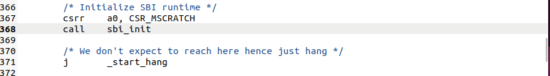
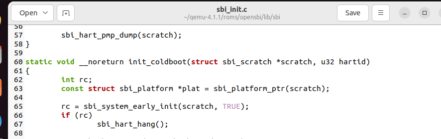
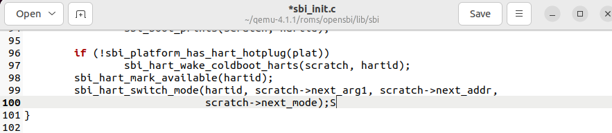
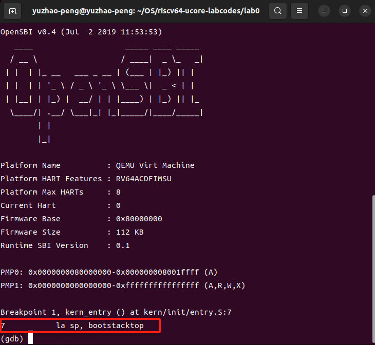
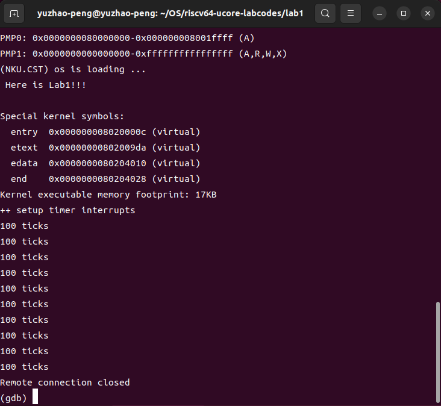
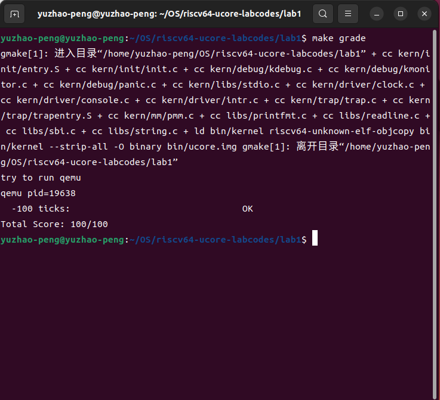
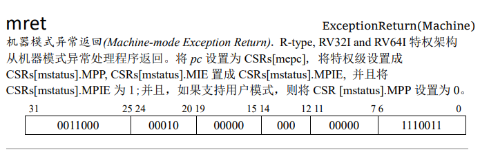
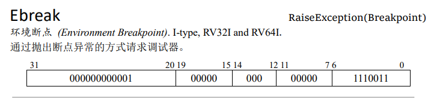
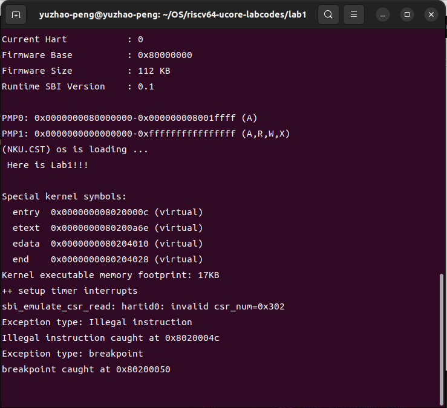
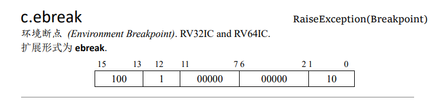

# Lab 0-1

彭钰钊 2110756	姜涵 2113630	王健行 2111065

### 一、实验要求：

- 基于markdown格式来完成，以文本方式为主
- 填写各个基本练习中要求完成的报告内容
- 列出你认为本实验中重要的知识点，以及与对应的OS原理中的知识点，并简要说明你对二者的含义，关系，差异等方面的理解（也可能出现实验中的知识点没有对应的原理知识点）
- 列出你认为OS原理中很重要，但在实验中没有对应上的知识点

### 二、知识点整理：

#### 重要知识点：

- 命令行
- 计算机启动过程
- 上下文切换 & 异常和中断的区别
- 权限模式

#### 额外知识点：

- OpenSBI在bootloader过程中的工作
- 中断类型

本学期我们的操作系统实验是要完成一个“玩具”操作系统——ucore在Risk-V上的移植，而为了实现这个目的我们需要以Ubuntu Linux作为实验的系统软件环境。虽然Ubuntu是图形界面友好和易操作的linux发行版，但是Linux的使用者更加熟悉的风格是命令行操作【文本操作模式】。因此，命令行操作的熟悉至关重要！现在我们可以根据相关资料简单的使用命令行即可，但是我们不应该忽视命令行与操作系统原理的关联。

- 命令行界面(ommand-Line Interface，CLI)：操作系统提供的一种**文本方式**的用户界面，用户可以通过命令行输入命令来与操作系统进行交互。
- 文件系统：操作系统中用于组织和管理文件和文件夹的方式。命令行中的命令可以用于创建(mkdir/touch)、删除(rmdir/rm -r/rm)、移动(mv)、复制(cp)和查看(cat/ls/pwd)文件和文件夹等操作。
- 环境变量：操作系统中的一种机制，用于存储**系统级别**的配置信息，例如路径、系统默认设置等。可以使用命令行命令来查看、设置和使用环境变量。
- 进程管理：操作系统中运行的程序实例被称为进程。命令行命令可以用于查看当前运行的进程、启动和终止进程等操作。
- 网络配置：命令行可以用于配置和管理网络连接和设置，例如设置 IP 地址、查看网络状态、配置网络接口等。
- 用户和权限管理：操作系统通过用户和权限来管理对系统资源的访问。命令行命令可以用于创建、删除和管理用户账户，以及设置文件和目录的权限。
- 脚本和批处理：命令行中可以编写脚本或批处理文件，用于自动化一系列命令的执行，实现一些复杂的操作。

在后面的理论课程和实验中我们将进一步学习进程与线程、内存管理、文件系统、多处理机系统等操作系统相关的知识，事实上这些点在命令行操作中都有所体现。[Yuzhao:GUI在给我们普通用户带来无限方便的同时，其较（ji）低的学习成本——“所见即所得”，诱惑了我这个小（lan）白（gou），导致我对于命令行敬而远之。]

我们使用计算机开机的时候似乎很简单——按下电源键[Yuzhao:这不有手就行？]，然后等待几秒钟时间便可以看见桌面的GUI（用户图形界面）了，那么我们的计算机在这个过程中究竟悄悄做些了什么呢？

理论课上我们简单的了解了计算机的启动过程，在按下主机上的电源键之后，CPU收到一个reset信号进行复位初始化，这个时候**CS:IP**被强制初始化为**0xF000:0xFFF0**，在实模式下这就是BIOS的入口地址。所谓BIOS（基本输入输出系统，Basic Input & Output System）是固化在ROM之中的程序，其主要工作是进行硬件自检并对设备进行初始化，建立中断向量表并加载中断服务程序，而在BIOS的入口地址处实际上是一个长跳转指令:**jmp 0xF000:0xE05B**，BIOS把磁盘0盘0道1扇区的内容（实际上就是MBR程序——主引导记录Master Boot Record）加载到0x7C00，同时由boot程序完成寄存器初始化、加载FAT文件系统等工作。接下来压力给到loader程序，它将要完成模式转换以及启用段页管理，与此同时它将加载内核至内存，然后转接控制权。最后登场的是操作系统内核程序，它将进行内存初始化，创建用户态和内核态管理进程（1号、2号进程）……

到这里我们的计算机就算是启动成功了，那么我们的ucore是如何实现这个过程的呢？在加电之后，QEMU将会把作为bootloader的OpenSBI.bin被加载到物理内存以物理地址0x80000000开头的区域上，同时内核镜像os.bin被加载到以物理地址0x80200000开头的区域上。显而易见，与我们理论课上所学习的计算机启动过程相类似，都要经历加电$$\to$$bootloader引导程序$$\to$$操作系统内核程序的一个流程，关于我们的ucore具体在操作系统内核程序执行之前的具体过程将在【Lab 0.5】练习1中进一步说明。

在第一部分的实验中我们完成了一个最小可执行内核，现在要在该基础上增加中断机制。 在本部分实验中中断与异常的实现关键一节是**上下文切换**，这对应于我们所学的**进程切换**，当操作系统切换进程状态时需要终止当前进程并保存和恢复寄存器状态。值得强调的是中断和异常的区别：

- **中断（Interrupt）**：由外部信号触发，可以是与CPU异步的，并不依赖于当前指令执行状态，通常需要保存当前正在执行的进程的上下文，然后切换到中断处理程序，以处理中断事件。一旦中断处理程序完成，处理器将恢复之前的上下文，继续执行中断之前的任务。
- **异常（Exception）**：由处理器内部的事件或错误条件引起的事件，通常是由当前指令的执行状态触发的，是一种同步事件。一旦异常处理程序完成，通常会继续执行引发异常的指令。

简单的说就是中断返回下一条指令地址，异常返回当前异常指令地址。[Yuzhao:希望表述没有错误]。此外，在实际的计算机中中断类型不仅仅是实验中实现的简单硬件中断——时钟中断，还包括外部I/O中断、软中断（系统中断、调试中断）等诸多类型。同时，在本实验中还有一个重要的知识点是权限模式：

- 用户态：运行应用程序
- 内核态：运行操作系统内核程序
- 特权模式：介于上两者之间

而我们实验中的权限模式稍有不同，粗略的分类：U-mode是用户程序、应用程序的特权级，S-mode是操作系统内核的特权级，M-mode是固件的特权级。

### 三、实验练习：

#### 【Lab 0.5】**练习1: 使用GDB验证启动流程**

> 为了熟悉使用qemu和gdb进行调试工作,使用gdb调试QEMU模拟的RISC-V计算机加电开始运行到执行应用程序的第一条指令（即跳转到0x8020000执行过程，说明RISC-V硬件加电后的几条指令在哪里？完成了哪些功能？要求在报告中简要写出练习过程和回答。

CPU启动上电~加载bootloader

通电后，查看pc处10条汇编指令，并对这些指令逐条分析。指令如下：

```shell
 (gdb) x/10i $pc
 => 0x1000:  auipc   t0,0x0
    0x1004:  addi    a1,t0,32
    0x1008:  csrr    a0,mhartid
    0x100c:  ld  t0,24(t0)
    0x1010:  jr  t0
    0x1014:  unimp
    0x1016:  unimp
    0x1018:  unimp
    0x101a:  0x8000
    0x101c:  unimp
```

- auipc 指令是 用于将一个 20 位的立即数扩展到 32 位，然后与当前指令的 PC相加，将结果存储在目标寄存器中。这个指令通常用于生成全局地址，以便访问全局变量或进行跳转。该指令执行结束后，查看t值： (gdb) info r t0 t0             0x0000000000001000   4096
- 执行 `addi        a1,t0,32`后，a1值为0x1020。
- 在RISC-V的调用约定中，`a1`通常用于传递参数。我们查看0x1020附近汇编代码。

```Plain
 0x1020  addi   a2,sp,724                           
 0x1022  sd     t6,216(sp) 
 0x1024  unimp           
 0x1026  addiw  a2,a2,3           
```

0x1020可能为一个函数的地址，0x1020与0x1022对栈指针sp进行了调整，还将寄存器`t6`的值保存在栈上。

- 执行`csrr        a0,mhartid` ，从mhartid寄存器中读取值，将处理器的硬件线程 ID加载到寄存器 `a0` 中。 Hart ID 是多核处理器中的一个唯一标识符，用于区分不同的处理器核心。查看寄存器发现值为0。
- `0x100c: ld   t0,24(t0)`指令，作用是从内存中的地址 `t0 + 24 = 0x1018` 处加载 64 位的数据，并将其存储在寄存器 `t0` 中。这里储存的数据可以从上面的代码段读出加载为0x80000000。
- 随后跳转至0x80000000处。

0x80000000附近的10条汇编指令如下：

```SQL
(gdb) x/10i 0x80000000
   0x80000000:        csrr        a6,mhartid
   0x80000004:        bgtz        a6,0x80000108
   0x80000008:        auipc        t0,0x0
   0x8000000c:        addi        t0,t0,1032
   0x80000010:        auipc        t1,0x0
   0x80000014:        addi        t1,t1,-16
   0x80000018:        sd        t1,0(t0)
   0x8000001c:        auipc        t0,0x0
   0x80000020:        addi        t0,t0,1020
   0x80000024:        ld        t0,0(t0)
```

0x80000000处指令`csrr a6,mhartid`的作用是将处理器的硬件线程ID存储在寄存器a6中。

其对应于/qemu-4.1.1/roms/opensbi/firmware/fw_base.S处的启动代码（具体解释见注释）：

```Assembly
_start:
        /*
         * Jump to warm-boot if this is not the first core booting,
         * that is, for mhartid != 0
         */
        csrr        a6, CSR_MHARTID /*使用csrr指令来将处理器的当前线程ID存储在寄存器a6中*/
        blt        zero, a6, _wait_relocate_copy_done/*使用blt指令判断a6是否小于零，如果是，则跳转到"_wait_relocate_copy_done"的位置*/

        /* Save load address *//*保存加载地址*/
        la        t0, _load_start/*使用la指令将标签"_load_start"的地址存储在寄存器t0中*/
        la        t1, _start/*将标签"_start"的地址存储在寄存器t1中*/
        REG_S        t1, 0(t0)/*使用REG_S指令将t1的值存储在t0的偏移为0的内存位置上，这个操作可能是为了保存加载地址的信息供以后使用*/

        /* Relocate if load address != link address */
```

读取CSR_MHARTID寄存器来确定当前是第几个核启动。如果mhartid为0，则说明当前为第一个启动的核心，继续执行下面代码（否则跳转到_wait_relocate_copy_done标签）：

```Assembly
_relocate:
        la        t0, _link_start
        REG_L        t0, 0(t0)/*获取"_link_start"的值并存储在t0中*/
        la        t1, _link_end
        REG_L        t1, 0(t1)/*获取"_link_end"的值并存储在t1中*/
        la        t2, _load_start
        REG_L        t2, 0(t2)/*获取"_load_start"的值并存储在t2中。*/
        sub        t3, t1, t0/*计算"_link_end"和"_link_start"之间的偏移*/
        add        t3, t3, t2/*计算"_link_start"与"_link_end"之间的偏移，并与"_load_start"相加*/
      /*检查"_link_start"和"_load_start"是否相等，如果相等，则说明无需进行数据迁移。*/
        beq        t0, t2, _relocate_done
      /*如果"_link_start"和"_load_start"不相等，接下来的指令将计算"_relocate_done"标签的地址，并通过"sub"和"add"指令将其存储在t4中。*/
        la        t4, _relocate_done
        sub        t4, t4, t2
        add        t4, t4, t0
        blt        t2, t0, _relocate_copy_to_upper
        /*通过"blt"指令判断t2是否小于t0，如果是，则跳转到"_relocate_copy_to_upper"标签处执行。这个判断的作用是检查"_load_start"是否位于"_link_start"之上，如果是，则需要执行数据迁移。*/
```

保存第一个启动核心的加载地址（_load_start）和链接地址（link_start），检查二者是否相等，相等则跳转到`_relocate_done`，不等则进行数据迁移（`_relocate_copy_to_lower_loop`、`_relocate_copy_to_upper_loop`）。

`_relocate_done`部分：

```Assembly
_relocate_done:

        /* mark relocate copy done */
        /*过将值1存储到_boot_status指向的内存地址中，标记重定位操作已完成。此后，可能会有其他操作来检查这个标记以确认重定位是否成功。*/
        la        t0, _boot_status
        li        t1, 1
        REG_S        t1, 0(t0)
        fence        rw, rw

        /* At this point we are running from link address */

        /* Reset all registers for boot HART */
        /*使用_reset_regs函数将寄存器ra的值设置为0，重置了所有的寄存器。*/
        li        ra, 0
        call        _reset_regs

        /* Allow main firmware to save info */
        /*调用fw_save_info函数来允许主固件保存信息*/
        MOV_5R        s0, a0, s1, a1, s2, a2, s3, a3, s4, a4
        call        fw_save_info
        MOV_5R        a0, s0, a1, s1, a2, s2, a3, s3, a4, s4

        /* Preload HART details
         * s7 -> HART Count
         * s8 -> HART Stack Size
         *//*加载与硬件线程相关的一些信息*/
        la        a4, platform
#if __riscv_xlen == 64
        lwu        s7, SBI_PLATFORM_HART_COUNT_OFFSET(a4)
        lwu        s8, SBI_PLATFORM_HART_STACK_SIZE_OFFSET(a4)
#else
        lw        s7, SBI_PLATFORM_HART_COUNT_OFFSET(a4)
        lw        s8, SBI_PLATFORM_HART_STACK_SIZE_OFFSET(a4)
#endif

        /* Setup scratch space for all the HARTs*/
        /*这段代码为所有硬件线程设置临时空间（即scratch space）*/
        la        tp, _fw_end
        mul        a5, s7, s8
        add        tp, tp, a5
        /* Keep a copy of tp */
        add        t3, tp, zero
        /* Counter */
        li        t2, 1
        /* hartid 0 is mandated by ISA */
        li        t1, 0
```

在这部分主要进行了重置寄存器、为硬件线程设置临时空间的操作。

重定位结束后，进入_`scratch_init`代码段，进行一些必要的初始化操作，包括存储固件参数和清零未初始化的全局变量空间，为固件的正常运行做准备。其中fw_next_addr对应下一个引导阶段地址，即0x80200000。


紧接着执行`_bss_zero:`，将bss段（未初始化数据段）清零：

```Assembly
_bss_zero:
        REG_S        zero, (a4)
        add        a4, a4, __SIZEOF_POINTER__
        blt        a4, a5, _bss_zero

        /* Override pervious arg1 */
        MOV_3R        s0, a0, s1, a1, s2, a2
        call        fw_prev_arg1
        add        t1, a0, zero
        MOV_3R        a0, s0, a1, s1, a2, s2
        beqz        t1, _prev_arg1_override_done
        add        a1, t1, zero
```

`_prev_arg1_override_done`、`_fdt_reloc_again`、`_fdt_reloc_done`：将FDT（*Flattened Device Tree*）从一个地址复制到另一个地址，并确定复制数据的正确性，同时标记HART已引导。

最后进入`_start_warm`：对非启动的HART进行初始化，配置临时存储空间和陷阱处理程序，并初始化SBI运行时环境，代码跳转到_start_hang标签处进入等待状态。

其中在初始化SBI运行时环境的时候，调用`sbi_init`函数，



进入sbi_init.c(地址：~/qemu-4.1.1/rooms/opensbi/lib/sbi/sbi_init.c),执行 `init_coldboot`



在`init_coldboot`的最后，执行`sbi_hart_switch_mode()`，跳转到0x8020000处(`next_addr`)。



#### **【Lab 1】练习1：理解内核启动中的程序入口操作**

> 阅读 kern/init/entry.S内容代码，结合操作系统内核启动流程，说明指令 la sp, bootstacktop 完成了什么操作，目的是什么？ tail kern_init 完成了什么操作，目的是什么？

```c
#include <mmu.h>
#include <memlayout.h>

# The ,"ax",@progbits tells the assembler that the section is allocatable ("a"), executable ("x") and contains data ("@progbits").
# 从这里开始.text 这个section, "ax" 和 %progbits描述这个section的特征
# https://www.nongnu.org/avr-libc/user-manual/mem_sections.html
.section .text,"ax",%progbits 
    .globl kern_entry # 使得ld能够看到kern_entry这个符号所在的位置, globl和global同义
    # https://sourceware.org/binutils/docs/as/Global.html#Global
kern_entry: 
    la sp, bootstacktop 
    tail kern_init 
#开始data section
.section .data
    .align PGSHIFT #按照2^PGSHIFT进行地址对齐, 也就是对齐到下一页 PGSHIFT在 mmu.h定义
    .global bootstack #内核栈
bootstack:
    .space KSTACKSIZE #留出KSTACKSIZE这么多个字节的内存
    .global bootstacktop #之后内核栈将要从高地址向低地址增长, 初始时的内核栈为空
bootstacktop:
```

在Lab 0的最小可执行内核中，我们将断点设在0x80200000处执行程序可以得到如下情形：



即，我们停在了上电后的第一条程序指令之前，接下来我们会执行两条汇编语句，将控制权转入内核，在这里我们将要执行代码段.text的第一条指令——`la sp, bootstacktop`指令，`la`即load address，`bootstacktop` 代表内核启动栈的栈顶位置，

这条指令的目的是将栈指针寄存器 `sp` 的值设置为内核启动栈的顶部，从而为内核代码的执行提供栈空间。栈常用于存储局部变量、返回地址等数据，这条指令对栈进行了初始化，确保内核能够正常运行。

`tail kern_init` tail是一种函数调用指令，与传统的调用方式相比它不会在栈上创建新的函数调用帧，而是立即执行跳转到函数的返回地址,也就是不再返回，作用是分配好内核栈后进入到真正的内核入口点。顺带说一下尾调用的优势——有效避免了栈溢出的问题。

#### **【Lab 1】练习2：完善中断处理 （需要编程）**

> 请编程完善trap.c中的中断处理函数trap，在对时钟中断进行处理的部分填写kern/trap/trap.c函数中处理时钟中断的部分，使操作系统每遇到100次时钟中断后，调用print_ticks子程序，向屏幕上打印一行文字”100 ticks”，在打印完10行后调用sbi.h中的shut_down()函数关机。
>
> 要求完成问题1提出的相关函数实现，提交改进后的源代码包（可以编译执行），并在实验报告中简要说明实现过程和定时器中断中断处理的流程。实现要求的部分代码后，运行整个系统，大约每1秒会输出一次”100 ticks”，输出10行。

在`kern/driver/clock.c`文件中我们可以找到与clock_set_next_event()相关的代码

```C
 // Hardcode timebase
 static uint64_t timebase = 100000;
 
 void clock_init(void) {
     // sie这个CSR可以单独使能/禁用某个来源的中断。默认时钟中断是关闭的
     // 所以我们要在初始化的时候，使能时钟中断
     set_csr(sie, MIP_STIP); // enable timer interrupt in sie
     //设置第一个时钟中断事件
     clock_set_next_event();
     // 初始化一个计数器
     ticks = 0;
 
     cprintf("++ setup timer interrupts\n");
 }
 //设置时钟中断：timer的数值变为当前时间 + timebase 后，触发一次时钟中断
 //对于QEMU, timer增加1，过去了10^-7 s， 也就是100ns
 void clock_set_next_event(void) { sbi_set_timer(get_time() + timebase); }
```

在`libs/sbi.c`文件中我们可以找到关机函数代码，小小吐槽一下题干中的“调用sbi.h中的shut_down()函数”，实际上应该是sbi_shutdown()函数。

```C
 void sbi_shutdown(void)
 {
     sbi_call(SBI_SHUTDOWN,0,0,0);
 }
```

对于我们的QEMU时钟频率为$$\frac{1}{时间间隔}=\frac{1}{10^{-7}}=10^7Hz$$，那么时间片长度计算公式为$$时间片长度=\frac{timebase}{时钟频率}=\frac{100000}{10^7}=10ms$$，我们要求实现使操作系统每遇到100次时钟中断后（即大约每秒），输出一次100 ticks（调用print_ticks子程序），注意判断输出次数，另外在`trap.c`中宏定义`#define TICK_NUM 100`，即100次时钟中断；在源码文件中还定义了打印计数的变量num。

```C
 case IRQ_S_TIMER:
             // "All bits besides SSIP and USIP in the sip register are
             // read-only." -- privileged spec1.9.1, 4.1.4, p59
             // In fact, Call sbi_set_timer will clear STIP, or you can clear it
             // directly.
             // cprintf("Supervisor timer interrupt\n");
              /* LAB1 EXERCISE2   YOUR CODE :  */
             /*(1)设置下次时钟中断- clock_set_next_event()
              *(2)计数器（ticks）加一
              *(3)当计数器加到100的时候，我们会输出一个100ticks表示我们触发了100次时钟中断，同时打印次数（num）加一
             * (4)判断打印次数，当打印次数为10时，调用<sbi.h>中的关机函数关机
             */
             clock_set_next_event();
             ticks++;
             if(ticks % TICK_NUM == 0){
                 print_ticks();
                 if(++num == 10)
                     sbi_shutdown();
             }
             break;
```

接下来让我们在lab1文件夹内打开终端make一下，然后make test并continue查看结果~



可以看见我们输出了10次“100 ticks”之后断开了连接。那么make grade试试~



接下来让我们简单分析一下时钟中断的处理过程：

在内核加载的时候即`kern/init/init.c`中将会初始化中断向量表以及时钟中断，同时会调用clock_set_next_event()函数设置下一个时钟中断的时间点，当经过大约10ms（前文计算可知）时触发了IRQ_S_TIMER时钟中断，调用`kern/trap/trapentry.S`保存上下文，然后调用`kern/trap/trap.c`中的trap()函数处理中断，在trap_dispatch()函数进入interrupt_handler()函数分支处理。

Lab1实验内容基础练习到此为止，让我们继续完成扩展练习！Let's Go！

#### **【Lab 1】扩展练习 Challenge1：描述与理解中断流程**

> 回答：描述ucore中处理中断异常的流程（从异常的产生开始），其中mov a0，sp的目的是什么？SAVE_ALL中寄寄存器保存在栈中的位置是什么确定的？对于任何中断，__alltraps 中都需要保存所有寄存器吗？请说明理由。

**Cha1.1:ucore中处理中断异常的流程：**

一般OS中进行中断处理支持的方法为：编写相应的中断处理代码、在启动中正确设置控制寄存器、CPU捕获异常、控制转交给相应中断处理代码进行处理、返回正在运行的程序，此处我们从异常的产生（即CPU捕获异常）开始分析：

首先

进入lab1/kern/trap/trap.c,找到中断处理初始化函数`idt_init`，此函数中将__alltraps函数的地址赋给寄存器stvec，把stvec(中断向量表，用来存储异常处理程序的起始地址)设置成所有中断都要跳到`trapentry.S`进行处理。

```SQL
void idt_init(void) {
    extern void __alltraps(void);
    /* Set sscratch register to 0, indicating to exception vector that we are
     * presently executing in the kernel */
    write_csr(sscratch, 0);
    /* Set the exception vector address */
    write_csr(stvec, &__alltraps);
}
```

进入lab1/kern/trap/trapentry.S，找到`__alltraps`函数，这个函数将当前执行上下文所有寄存器的值保存，并且调用下一个中断函数`trap`.

```SQL
__alltraps:
    SAVE_ALL/*保存当前执行上下文中的所有寄存器的值，确保不丢失重要状态信息*/

    move  a0, sp/*将栈指针寄存器 sp 的值复制到寄存器 a0 中。这可能是为了将栈指针传递给下一个函数调用（trap 函数）。*/
    jal trap/*使用寄存器 a0 保存的栈指针作为参数，调用 trap 函数。*/
    # sp should be the same as before "jal trap"
/*在进行函数调用之后，栈指针 sp 的值应该与调用前保持一致。这是因为函数调用会将一些数据保存在栈上，在函数返回后需要正确恢复栈指针的值。*/
    .globl __trapret
    /*将 __trapret 标记为一个全局符号。这通常是用于链接器在编译和链接时解析符号引用的。这意味着代码中可能有一个标记为 __trapret 的符号存在，可能在其他地方被使用。
*/
```

进入lab1/kern/trap/trap.c,其内部定义的三个主要函数如下：

首先定义`trap_dispatch`函数，通过检查 `tf->cause` 变量的值确定中断类型，并调用相应函数对中断程序进行处理（中断处理`interrupt_handler`、异常处理`exception_handler`）。

```SQL
/* trap_dispatch - dispatch based on what type of trap occurred */
static inline void trap_dispatch(struct trapframe *tf) {
    if ((intptr_t)tf->cause < 0) {
        // interrupts
        interrupt_handler(tf);
    } else {
        // exceptions
        exception_handler(tf);
    }
}
```

其中`interrupt_handler`和`exception_handler`内部会对产生中断/异常的原因进一步划分，并针对不同情况提供相应解决办法。

然后返回lab1/kern/trap/trapentry.S中的`__alltraps`函数，执行`__trapret`：

```SQL
__trapret:
    RESTORE_ALL/*用来恢复保存的寄存器状态。它可能会将之前保存在堆栈或其他地方的寄存器值恢复到对应的寄存器中。*/
    /*从特权模式返回到之前的模式，通常是从超级用户态返回到用户态。它会恢复相关的寄存器和状态，使程序继续执行。*/
    # return from supervisor call
    sret
```

在异常或中断处理程序中进行特权级别的切换和恢复寄存器状态，返回到正常的执行流程中。

**Cha1.2**:mov a0，sp的目的:将栈指针寄存器 sp 的值复制到寄存器 a0 中。这可能是为了将栈指针传递给下一个函数调用（trap 函数）。

**Cha1.3**:SAVE_ALL中寄寄存器保存在栈中的位置是什么确定的？

寄存器保存的位置通过栈顶指针sp和偏移量进行计算。

**Cha1.4**:对于任何中断，__alltraps 中都需要保存所有寄存器吗？请说明理由。

不是在每个中断中都需要保存所有寄存器。在处理中断时，通常只有特定的寄存器需要被保存，而其他的寄存器可以被覆盖。具体需要保存的寄存器取决于中断处理的需求和编程语言的约定。

#### **【Lab 1】扩展练习 Challenge2：理解上下文切换机制**

> 回答：在trapentry.S中汇编代码 csrw sscratch, sp；csrrw s0, sscratch, x0实现了什么操作，目的是什么？save all里面保存了stval scause这些csr，而在restore all里面却不还原它们？那这样store的意义何在呢？

- ` csrw sscratch, sp`指令，为了将保存上下文前的sp寄存器的值存入上下文，需要将保存前的sp的值存入sscratch。中断前处于S态，sscratch的值原本为0
  -  `csrrw s0, sscratch, x0`指令，`s0`寄存器存入`sscratch`的值，又将x0保存到sscratch寄存器。x0在此为0，意味着将 `sscratch` 的值清0，恢复到了sscratch原先的值。

  -  两条汇编代码借助sscratch寄存器，成功保存了发生中断或异常时sp寄存器的值。
- `stval` 寄存器通常用于存储引发异常的指令的附加信息，`scause`寄存器通常用于记录中断原因，这些在处理时都会用到，所以要保存；这些信息被处理后，寄存器的值不再需要，因此不用恢复。
  -  `sstatus sepc`两寄存器的值需恢复，`sepc`需要恢复是因为当异常发生时，处理器将当前的 PC 值存储在 `sepc` 寄存器中，在异常处理结束后可以恢复执行被中断的指令；`sstatus`存储了当前处理器的特权级别和一些处理器状态标志，用于恢复中断使能状态和特权级别。

#### **【Lab 1】扩展练习Challenge3：完善异常中断**

> 编程完善在触发一条非法指令异常 mret和ebreak，在 kern/trap/trap.c的异常处理函数中捕获，并对其进行处理，简单输出异常类型和异常指令触发地址，即“Illegal instruction caught at 0x(地址)”，“ebreak caught at 0x（地址）”与“Exception type:Illegal instruction"，“Exception type: breakpoint”。

首先要实现**触发异常**，我们了解到mret是RISC-V中的特权指令，用于从机器模式（M-mode）返回到先前的模式，那么在非机器模式下的文件中使用该指令就意味着它是非法指令了，因此我们选择在`init.c`文件中加入内联汇编实现非法指令异常的触发和断点异常的触发，对应内联汇编代码如下：

```c
 asm volatile("mret");
 asm volatile("ebreak");
```

然后我们需要实现**捕获和处理**，关于捕获`kern/trap/trap.c`的异常处理函数已经帮我们完成，现在是补充处理函数：

```C
         case CAUSE_ILLEGAL_INSTRUCTION:
              // 非法指令异常处理
              /* LAB1 CHALLENGE3   YOUR CODE :  */
             /*(1)输出指令异常类型（ Illegal instruction）
              *(2)输出异常指令地址
              *(3)更新 tf->epc寄存器
             */
             cprintf("Exception type: Illegal instruction\n");
             cprintf("Illegal instruction caught at 0x%x\n", tf->epc);
             tf->epc+=4;
             break;
         case CAUSE_BREAKPOINT:
             //断点异常处理
             / LAB1 CHALLLENGE3   YOUR CODE :  */
             /*(1)输出指令异常类型（ breakpoint）
              *(2)输出异常指令地址
              *(3)更新 tf->epc寄存器
             */
             cprintf("Exception type: breakpoint\n");
             cprintf("breakpoint caught at 0x%x\n", tf->epc);
             //tf->epc+=4;
             tf->epc+=2;
             break;
```

我们选择打印异常信息然后跳过异常指令的方式来处理异常，那么这就需要我们知道异常指令的长度来更新我们的tf->epc寄存器。





查阅RISC-V手册我们发现这两条指令都是4字节（即32位），那么我们应当这样来更新寄存器的值：tf->epc+=4，现在让我们来调试一下看看结果：



按照预期，我们接下来应该输出10次“100 ticks”之后断开连接，但是这里并没有如我们预期的那样，而是停在了这里，说明是断点异常的处理出现了问题。



继续查阅RISC-V手册我们发现在RV32IC和RV64IC中有这样一个“压缩版ebreak”指令，它的长度只有2字节（即16位），那么我们尝试修改breakpoint异常的寄存器更新：tf->epc+=2。

现在再来调试查看结果如下：


事实证明，我们的猜测是正确的，我们将断点设置在0x80200000位置处，执行程序，然后查看后续汇编指令如下：

```Assembly
    0x80200000 <kern_entry>: auipc   sp,0x4
    0x80200004 <kern_entry+4>:   mv  sp,sp
    0x80200008 <kern_entry+8>:   j   0x8020000c <kern_init>
    0x8020000c <kern_init>:  auipc   a0,0x4
    0x80200010 <kern_init+4>:    addi    a0,a0,4
    0x80200014 <kern_init+8>:    auipc   a2,0x4
    0x80200018 <kern_init+12>:   addi    a2,a2,20
    0x8020001c <kern_init+16>:   addi    sp,sp,-16
    0x8020001e <kern_init+18>:   sub a2,a2,a0
    0x80200020 <kern_init+20>:   li  a1,0
    0x80200022 <kern_init+22>:   sd  ra,8(sp)
    0x80200024 <kern_init+24>:   jal ra,0x80200a5c <memset>
    0x80200028 <kern_init+28>:   jal ra,0x8020017a <cons_init>
    0x8020002c <kern_init+32>:   auipc   a1,0x1
    0x80200030 <kern_init+36>:   addi    a1,a1,-1468
    0x80200034 <kern_init+40>:   auipc   a0,0x1
    0x80200038 <kern_init+44>:   addi    a0,a0,-1428
    0x8020003c <kern_init+48>:   jal ra,0x80200102 <cprintf>
    0x80200040 <kern_init+52>:   jal ra,0x80200058 <print_kerninfo>
    0x80200044 <kern_init+56>:   jal ra,0x8020018a <idt_init>
    0x80200048 <kern_init+60>:   jal ra,0x80200136 <clock_init>
    0x8020004c <kern_init+64>:   mret
    0x80200050 <kern_init+68>:   ebreak
    0x80200052 <kern_init+70>:   jal ra,0x80200184 <intr_enable>
```

从这里我们可以发现mret指令长度为0x80200050-0x8020004c=4，ebreak指令长度为0x80200052-0x80200050=2，再次向我们证实了我们的猜测。

让我们回过头来看我们的输出会发现一个有点意外的语句：sbi_emulate_csr_read: hartid0: invalid csr_num=0x302，这是说我们在代码中使用了无效的CSR编号，或者处理器不支持某个特定CSR。机器模式异常返回(Machine-mode Exception Return)将会把pc设置为CSRs[mepc]，即mepc=0x302。这说明我们在非机器模式下使用了这个属于机器模式的特权指令，因此mret被当做了一条非法指令。

到此为止我们实现了Challenge 3。

