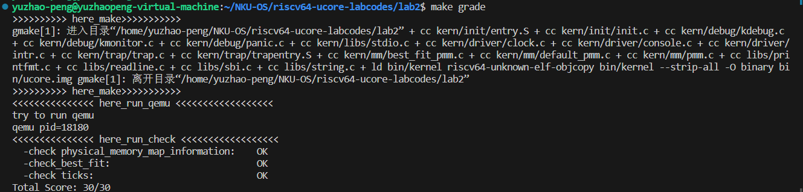
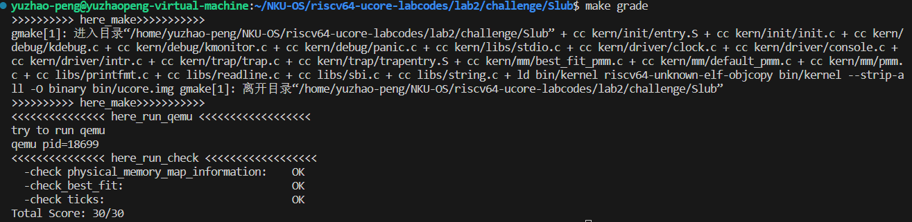
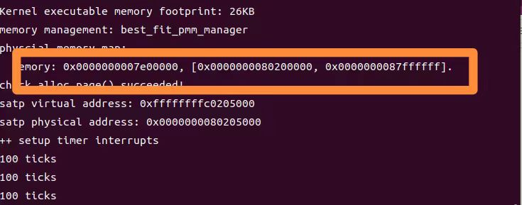

# Lab 2

彭钰钊 2110756	姜涵 2113630	王健行 2111065

## 一、实验要求：

- 基于markdown格式来完成，以文本方式为主
- 填写各个基本练习中要求完成的报告内容
- 列出你认为本实验中重要的知识点，以及与对应的OS原理中的知识点，并简要说明你对二者的含义，关系，差异等方面的理解（也可能出现实验中的知识点没有对应的原理知识点）
- 列出你认为OS原理中很重要，但在实验中没有对应上的知识点

## 二、知识点整理：

### （一）实验中重要的知识点与对应的OS原理

**为什么要进行内存管理？**

- 【实验】
  - **隔离与保护**：如果不进行内存管理我们将会使得所有程序处于同一地址空间内，这在运行多个程序时会导致访问同一个地址的冲突。
- 【理论】
  - **历史遗留**
    - 内存少：希望通过内存管理实现对有限的内存更加有效的利用，使之能够支撑更多的任务
    - 内存多：希望通过内存管理尽可能的不浪费内存资源【就是不能让它有摸鱼的机会】
  - **理想与现实**：程序员希望拥有私有的、容量无限大的、速度无限快的，并且断电不易失的存储器，同时还希望它价格低廉。但是，“理想很丰满，现实很骨感”，我们现在还无法实现这样的梦想，可我们需要通过某些手段来尽可能的去靠近我们的理想——**分层存储器体系**，在该体系中我们就需要实现内存的管理。
  - **易于使用**：我们将使用内存管理对内存进行虚拟化，让每个程序觉得，它有一个很大的连续地址空间（address space）来放入其代码和数据。这样程序员在编程的时候就可以不需要考虑在哪里存储变量的问题，从而大大解放程序员。
  - **隔离与保护**：我们不希望一个错误的程序能够读取或者覆写其他程序的内存，因此需要内存管理机制。

**内存管理机制**

- 【实验】分页管理机制
- 我们引入“翻译”机制和“页”的概念。
  - “翻译”机制：使不同的程序在访问相同的地址（实际上是逻辑地址）时经过翻译指向不同的物理地址，从而实现隔离与保护的目的。
  - 页：为了提高“翻译”效率，我们将连续的很多字节合在一起翻译，使其翻译前后数值之差相同。
- 【理论】
  - 动态分区分配：处理连续的内存分配，比较典型的是伙伴系统（Buddy System）。
  - 分区交换技术（swapping in/out）：抢占并回收处于等待状态进程的分区增大可用内存空间。
  - 内存覆盖技术：把程序分割成许多片段，称为覆盖（overlay）。
  - 虚拟内存——分页管理机制：每一页都有连续的地址范围，并被映射到物理内存

### **（二）其他重要知识点**

- **sv39页表机制：**
  - 每个页的大小是4KB，也就是4096个字节。
  - sv39的一个页表项占据8字节（64位）。其中第 53-10 位共44位为一个物理页号，表示这个虚拟页号映射到的物理页号。后面的第 9-0 位共10位则描述映射的状态信息。
- **sv39中，物理地址及虚拟地址的位数及各位表示**
  - sv39中，定义物理地址(Physical Address)有 56位，而虚拟地址(Virtual Address) 有 39位。
    1. 实际使用时：一个虚拟地址要占用 64位，只有低 39位有效，规定 63−39 位的值必须等于第 38 位的值（大家可以将它类比为有符号整数），否则会认为该虚拟地址不合法，在访问时会产生异常。
  - 物理地址、虚拟地址的最后12位表示的是页内偏移（这个地址在它所在页帧的什么位置（同一个位置的物理地址和虚拟地址的页内偏移相同）），除了最后12位，前面的部分表示的是物理页号或者虚拟页号。
-  并不是所有的虚拟页都有对应的物理页，虚拟页可能的数目远大于物理页的数目
- **多级页表**
  - 对页表进行“分级”，把很多页表项组合成一个”大页“，如果这些页表项都非法（没有对应的物理页），那么只需要用一个非法的页表项来覆盖这个大页，而不需要分别建立一大堆非法页表项。很多个大页(megapage)还可以组合起来变成大大页(gigapage!)，继而可以有更大的页。
  - 在本次实验中，sv39使用三级页表，有4KiB=4096字节的页，大小为2MiB= 2^21 字节的大页，和大小为1 GiB 的大大页。
  - 原先的一个39位虚拟地址，被我们看成27位的页号和12位的页内偏移。那么在三级页表下，我们可以把它看成9位的“大大页页号”，9位的“大页页号”（也是大大页内的页内偏移），9位的“页号”（大页的页内偏移），还有12位的页内偏移。
  - 整个Sv39的虚拟内存空间里，有512（2的9次方）个大大页，每个大大页里有512个大页，每个大页里有512个页，每个页里有4096个字节，整个虚拟内存空间里就有512∗512∗512∗4096个字节，是512GiB的地址空间。
- **建立快表以加快访问效率**
  - 为什么要建立
  -  物理内存的访问速度要比 CPU 的运行速度慢很多，按照页表机制一步步走，共需访问4次物理内存（3+1）才能读到我们想要的数据。

  - 根据什么建立
  -  虚拟地址的访问具有时间局部性和空间局部性。

  - > **被访问过一次的地址**很有可能不远的将来再次被访问、**被访问地址附近的地址**很有可能在不远的将来被访问。

  - 怎么使用
  -  在 CPU 内部，我们使用快表 (TLB, Translation Lookaside Buffer) 来记录近期已完成的虚拟页号到物理页号的映射。

  -  要做一个映射时，先到 TLB 里面去查一下，有的话我们就可以直接完成映射，而不用访问那么多次内存了。

  -  有时需要`sfence.vma` 指令刷新 TLB （切换到了一个与先前映射方式完全不同的页表、手动修改一个页表项之后）（不加参数的or后面加一虚拟地址，只刷新这个虚拟地址的映射）

### （三）内存分配算法

- **最先匹配算法(First Fit)**
  - 特点：从空闲区链首开始沿链顺序查找，直到找到满足大小要求的分区为止。
  - 优点：算法易实现，且保留了高地址部分的较大空闲区块。
  - 缺点：倾向于分配最早可用的空闲内存块，这可能会导致大量的内存碎片，降低后续查找效率。
- **循环首次适应算法(Next Fit)**
  - 特点：由First Fit衍生，区别在于算法从上一次分配内存结束的地方开始搜索可用内存块。
  - 优点：有助于减少内存碎片，降低查找开销
  - 缺点：导致缺少较大的内存空闲区块
- **最佳匹配算法(Best Fit)**
  - 特点：把满足需求且最接近进程所需大小的空闲内存块分配给进程
  - 优点：有助于减少内存碎片，提高内存的有效使用
  - 缺点：可能导致性能开销较大，内存中可能留下难以利用的小空闲区块
- **最差匹配算法(Worst Fit)**
  - 特点：选择最大的可用内存块来满足请求
  - 优点：有助于减少内存碎片，特别是外部碎片
  - 缺点：导致缺少较大的内存空闲区块，可能导致性能开销较大

### （四）OS原理中重要，但在实验中没有对应的知识

- 操作系统原理中，多线程管理是一个非常重要的领域，在现代计算机系统中多线程的应用日渐广泛。多线程管理涉及到操作系统如何创建、调度、同步和终止线程，以及线程之间的资源共享和互斥等方面的知识
- 内存映射文件是一种将文件内容映射到进程的虚拟地址空间中的机制。这意味着文件的内容可以像内存一样被访问，而不需要常规的文件读写操作。内存映射文件允许进程用内存读/写指令来访问文件内容，在提高性能、支持大型文件、实现共享内存、简化文件访问和增加数据持久性上有着重要意义。
- 缺页异常、页面置换等也是操作系统中与虚拟内存管理相关的重要概念，允许操作系统更有效地管理内存资源，以便在有限的物理内存下支持更大的虚拟内存空间；常见的页面置换算法包括FIFO（先进先出）、LRU（最近最少使用）、LFU（最不常使用）等，实验并未涉及相关内容。

## 三、实验练习：

#### 练习1：理解first-fit 连续物理内存分配算法（思考题）

> first-fit 连续物理内存分配算法作为物理内存分配一个很基础的方法，需要同学们理解它的实现过程。请大家仔细阅读实验手册的教程并结合`kern/mm/default_pmm.c`中的相关代码，认真分析default_init，default_init_memmap，default_alloc_pages， default_free_pages等相关函数，并描述程序在进行物理内存分配的过程以及各个函数的作用。
>
> 请在实验报告中简要说明你的设计实现过程。请回答如下问题：
>
> 
>
> - 你的first fit算法是否有进一步的改进空间？

最先匹配（first-fit）策略的实现思路是找到第一个足够大的块，将请求的空间返还给用户，将剩余的空间放入空闲列表。具体实现的原理如下：

我们会维护一个空闲列表，在收到内存请求的时候沿着空闲列表进行扫描，寻找第一个足够大的空间区块分配给用户，如果选中的区块比请求的内存大得多，则进行拆分返回用户所需要的空间并将剩余空间添加到空闲列表中。

该内存分配算法实现相对简单，并且效率相对较高。由于他在分配过程中是找到第一个比请求内存大的分区，因此无需遍历整个空闲列表，这就减小了时间开销。但是这个算法容易产生外部碎片，同时如果请求的内存较大时，时间开销较大。

以上是关于first-fit连续物理内存分配算法的理论原理简述，下面我们来具体看一看在实验中是如何实现该算法的。分析将从以下几个方面展开。

- **准备分析**

在进入`default_pmm.c`文件中具体分析first-fit算法之前，我们首先来看一些特殊的结构——`free_area_t`、`page`等。

```C
 /*free_area_t(memlayout.h)  维护一个记录空闲（未使用）页面的双链路列表*/
 typedef struct {
     list_entry_t free_list; // 列表头
     unsigned int nr_free; // free list 中空闲页面的数量
 } free_area_t;
```

首先我们来看一下空闲区块列表的数据结构，这个数据结构维护了一个双向链表，通过该链表可以追踪并管理空闲区块。具体而言，该结构体包括两个成员变量：

- `free_list`：一个list_entry_t结构类型的变量，我们进一步追踪该结构体可以发现，最终定位到了list_entry(`list.h`文件：关于链表的相关处理函数也在`list.h`文件中定义和处理)结构体中，其中包含了一个前向指针和一个后向指针。分析后可知，free_list维护了记录空闲区块的双向链表的链表头部。
- `nr_free`：一个无符号整型变量，用于记录free_list中元素的数量，通过该变量可以快速得到链表的元素数量，即空闲区块数量。

接下来我们接着看一下实现页的物理结构：

```C
 struct Page {
     int ref;                        // page frame's reference counter
     uint64_t flags;                 // array of flags that describe the status of the page frame
     unsigned int property;          // the num of free block, used in first fit pm manager
     list_entry_t page_link;         // free list link
 };
```

这个数据结构描述了物理页面的相关信息，在`kern/mm/pmm.h`中我们可以找到将页面转换为其他数据类型的相关函数，我们对于这个结构进行进一步的分析：

- `ref`：一个整型变量，页面帧的引用计数器，用于跟踪页面的被引用次数。
- `flags`：一个uint64_t结构类型的变量，是描述页面帧状态的标志数组。
- `property`：一个无符号整型变量，用于记录最先匹配（first-fit）页管理器中的空闲块数量，便于算法选择。
- `page_link`：一个用于实现链表数据结构。这个成员表示一个链接到页面帧链表中的链接，用于进行页面分配和释放等操作。

准备阶段分析到此结束，接下来我们将继续分析`default_pmm.c`文件中的其他函数：

- **default_init函数**

```C
 static void
 default_init(void) {
     list_init(&free_list);
     nr_free = 0;
 }
```

该函数为默认初始化函数；具体而言在函数体中调用`list_init`函数，传入参数`free_list`（链表头），接下来进入文件`list.h`中查看`list_init`函数，我们可以发现该函数将链表头的前向指针和后向指针都指向了自己——即初始化为空链表，同时`nr_free=0`将空闲页面数置为0。

- **default_init_memmap函数**

```C
 static void
 default_init_memmap(struct Page base, size_t n) {
     assert(n > 0);
     struct Page *p = base;
     for (; p != base + n; p ++) {
         assert(PageReserved(p));
         p->flags = p->property = 0;
         set_page_ref(p, 0);
     }
     base->property = n;
     SetPageProperty(base);
     nr_free += n;
     if (list_empty(&free_list)) {
         list_add(&free_list, &(base->page_link));
     } else {
         list_entry_t** le = &free_list;
         while ((le = list_next(le)) != &free_list) {
             struct Page* page = le2page(le, page_link);
             if (base < page) {
                 list_add_before(le, &(base->page_link));
                 break;
             } else if (list_next(le) == &free_list) {
                 list_add(le, &(base->page_link));
             }
         }
     }
 }
```

该函数用于初始化一个空闲页表，接受两个参数：指向`Page`结构类型的基地址和一个表示要初始化的页表项数量的整数n。具体而言函数分析如下：

首先利用断言`assert(n>0)`确保传入的参数n大于零（即要初始化的页表项数量大于零），否则程序终止；接着声明并初始化一个`Page`结构类型的指针p指向基地址base；然后进入循环，从基地址开始遍历每一个将要初始化的页表项，同时每一次遍历时利用断言`assert(PageReserved(p))`判断当前页是否为保留页面，通常某些页会被保留用于特定目的，例如内核代码或者设备驱动程序，这些页不应该用于通用内存分配，确保不对保留页面进行非法的初始化操作，将当前页表项的标志位和空闲块数量均置为0，调用`set_page_ref`函数将表的引用计数器设置为0（未引用）；循环结束后将基地址的空闲块数量设置为n，即base页的`property`参数为连续页数的总值，同时调用`SetPageProperty`函数将基地址页表的`property`标志位置为1，表示这个页是页表；然后更新全局变量`nr_free`，加上n，表示增加n个可用的空闲页表项数量。

然后，是一系列管理空闲区块链表的操作，检查双向链表是否为空，如果`free_list`为空，将当前页面的`page_link`添加到空闲区块链表`free_list`中；否则，执行如下的分支，将当前页面的`page_link`插入链表中的合适位置：定义一个指向链表`free_list`的迭代器`le`，初始化为链表的起始位置，进入循环来遍历空闲区块链表（利用`list_next`函数，不断更新迭代器`le`，直至指向链表头`free_list`）。

在循环中调用`le2page`函数（`kern/mm/memlayout.h`）将`le`转换为`Page`结构的指针`page`，以便与页面的基地址比较，如果base<page，那么表示已经找到了插入位置，调用`list_add_before`函数将base插入迭代器`le`当前指向的节点之前并且跳出循环；否则继续遍历，直至将整个链表遍历完，将base插入链表尾部。

此时，函数完成了初始化一个页表，将页面帧的信息、属性、引用计数等进行适当的设置，并将页面帧添加到空闲页面链表中以供后续使用。

- **default_alloc_pages函数**

```C
 static struct Page *
 default_alloc_pages(size_t n) {
     assert(n > 0);
     if (n > nr_free) {
         return NULL;
     }
     struct Page *page = NULL;
     list_entry_t *le = &free_list;
     while ((le = list_next(le)) != &free_list) {
         struct Page p = le2page(le, page_link);
         if (p->property >= n) {
             page = p;
             break;
         }
     }
     if (page != NULL) {
         list_entry_t* prev = list_prev(&(page->page_link));
         list_del(&(page->page_link));
         if (page->property > n) {
             struct Page *p = page + n;
             p->property = page->property - n;
             SetPageProperty(p);
             list_add(prev, &(p->page_link));
         }
         nr_free -= n;
         ClearPageProperty(page);
     }
     return page;
 }
```

该函数用于在空闲区块链表中查找第一个空闲块（块大小 >=n），并重新分配空闲块，返回已分配块的地址。具体而言函数分析如下：

首先依然是利用断言`assert(n > 0)`确保传入的参数n，即分配块大小大于零，接着检查可用空闲页面的数量，并将其分为如下三种情况：

1. 当可用的空闲块的大小（`nr_free`）小于n时，此时无法找到满足分配要求的空闲块，分配失败并返回NULL；否则，遍历链表直至找到合适的空闲块，然后又有以下两种情况；
2. 当已找到空闲块的大小大于n时，将这个空闲块进行分割，将请求的内存大小n分配之后，该空闲块剩余部分继续放入链表（原位置），更新可用空闲块大小；
3. 当已找到的空闲块恰好等于n时，直接分配，并更新相关参数。

该函数的主要目的是在空闲页面帧链表中查找并分配一定数量的页面帧，如果找到合适的页面帧，将其从链表中移除，并根据需要将剩余部分的页面帧添加回链表。

- **default_free_pasges函数**

```C
 static void
 default_free_pages(struct Page base, size_t n) {
     assert(n > 0);
     struct Page *p = base;
     for (; p != base + n; p ++) {
         assert(!PageReserved(p) && !PageProperty(p));
         p->flags = 0;
         set_page_ref(p, 0);
     }
     base->property = n;
     SetPageProperty(base);
     nr_free += n;
 
     if (list_empty(&free_list)) {
         list_add(&free_list, &(base->page_link));
     } else {
         list_entry_t** le = &free_list;
         while ((le = list_next(le)) != &free_list) {
             struct Page* page = le2page(le, page_link);
             if (base < page) {
                 list_add_before(le, &(base->page_link));
                 break;
             } else if (list_next(le) == &free_list) {
                 list_add(le, &(base->page_link));
             }
         }
     }
 
     list_entry_t* le = list_prev(&(base->page_link));
     if (le != &free_list) {
         p = le2page(le, page_link);
         if (p + p->property == base) {
             p->property += base->property;
             ClearPageProperty(base);
             list_del(&(base->page_link));
             base = p;
         }
     }
 
     le = list_next(&(base->page_link));
     if (le != &free_list) {
         p = le2page(le, page_link);
         if (base + base->property == p) {
             base->property += p->property;
             ClearPageProperty(p);
             list_del(&(p->page_link));
         }
     }
 }
```

该函数是释放一段连续的物理内存页（n页），将页面重新链接到空闲列表中，可能会将小的空闲块合并到大的空闲块中。具体而言函数分析如下：

首先依然是利用断言`assert(n > 0)`确保传入的参数n，即释放块大小大于零，接着声明并初始化一个`Page`结构类型的指针p指向即将释放的页面的起始地址`base`；然后遍历释放块内所有的页面帧，并检查确保它既不是保留页面（`PageReserved`），也不带有任何属性（`PageProperty`），接着当前页面帧的标志位`flags`清零，以表示该页面帧不再具有特殊状态，同时将当前页面帧的引用计数设置为0，表示该页面帧不再被引用；循环结束后，将`base`页面帧的`property`属性设置为`n`，表示这些连续的页面帧数量，调用`SetPageProperty`函数将`base`页面帧标记这些页面帧为空闲页面帧，并更新可用空闲页面帧的数量；接着执行插入空闲链表的操作。

随后将释放的物理页添加回空闲页链表 free_list 中。若 free_list 为空，将释放的页作为链表的第一个元素，否则它会遍历链表并将释放的页插入到适当的位置。

在最后一个过程中，值得注意的是如果释放之后的空闲块可以合并，即存在前/后一个页面帧，并且相邻，则合并前/后一个页面帧的属性和要释放的页面帧的属性，最后清除要释放的页面帧的属性，并从空闲页面链表中删除已释放/下一个的页面帧，同时更新`base`指针，使其指向合并后的页面帧。

**优化思路：**

**现有数据结构的优化**：在不改变使用双向链表的基础上，我们可以考虑修改插入策略（或者说排序策略），不再简单的按照地址由小到大排列，而是考虑按照空闲块的大小进行排序，这样可以更快的搜索到适合大小的空闲块，减少时间开销。

**更好的数据结构**：目前的实现使用了一个简单的双向链表，这种数据结构对于内存块的查找和插入效率可能不是最高的。可以考虑使用其他更高效的数据结构，如二叉堆、跳表、红黑树等，以提高内存分配和释放的性能。

#### 练习2：实现 Best-Fit 连续物理内存分配算法（需要编程）

> 在完成练习一后，参考kern/mm/default_pmm.c对First Fit算法的实现，编程实现Best Fit页面分配算法，算法的时空复杂度不做要求，能通过测试即可。
>
> 请在实验报告中简要说明你的设计实现过程，阐述代码是如何对物理内存进行分配和释放，并回答如下问题：
>
> 
>
> - 你的 Best-Fit 算法是否有进一步的改进空间？

经过观察分析，事实上我们只需要在first-fit的基础上修改`best_fit_alloc_pages`函数即可，具体代码如下所示：

```C
static struct Page *
best_fit_alloc_pages(size_t n) {
    assert(n > 0);
    if (n > nr_free) {
        return NULL;
    }
    struct Page *page = NULL;
    list_entry_t *le = &free_list;
    size_t min_size = nr_free + 1;
     /*LAB2 EXERCISE 2: YOUR CODE*/ 
    // 下面的代码是first-fit的部分代码，请修改下面的代码改为best-fit
    // 遍历空闲链表，查找满足需求的空闲页框
    // 如果找到满足需求的页面，记录该页面以及当前找到的最小连续空闲页框数量
    while ((le = list_next(le)) != &free_list) {
        struct Page *p = le2page(le, page_link);
        if (p->property >= n && p->property < min_size) { // 如果当前的空闲块小于"最小量"
            page = p;
            // 更新最小的空闲块大小，直到找到最小的适合空闲块
            min_size = p->property;
        }
    }

    if (page != NULL) {
        list_entry_t* prev = list_prev(&(page->page_link));
        list_del(&(page->page_link));
        if (page->property > n) {
            struct Page *p = page + n;
            p->property = page->property - n;
            SetPageProperty(p);
            list_add(prev, &(p->page_link));
        }
        nr_free -= n;
        ClearPageProperty(page);
    }
    return page;
}
```

**运行结果：**



**优化思路：**

由于我们的best-fit连续物理内存分配算法是在first-fit算法的基础上进行的简单修改，因此在first-fit中适用的优化方法在我们的best-fit中叶同样适用。但是，让我们回过头来思考一下，前面提到的两种方法真的能够有效的优化我们的算法吗？我们优化的思路主要集中在优化分配过程的搜索上面，但是我们提出的以一种方法是否会导致释放过程的合并更加复杂呢？答案是，在不改变现有的其他结构的基础上是必然会增加复杂程度的，因此我们的优化思路仅仅针对于算法中最核心的分配问题，而并非对于整个算法而言的。总的来说，在一定程度上我们的优化思路是能够起到提高我们算法效率的目的的，但最终的优化思路是设计更加适合的物理内存管理算法。

#### 扩展练习Challenge：buddy system（伙伴系统）分配算法（需要编程）

> Buddy System算法把系统中的可用存储空间划分为存储块(Block)来进行管理, 每个存储块的大小必须是2的n次幂(Pow(2, n)), 即1, 2, 4, 8, 16, 32, 64, 128...
>
> 
>
> - 参考[伙伴分配器的一个极简实现](http://coolshell.cn/articles/10427.html)， 在ucore中实现buddy system分配算法，要求有比较充分的测试用例说明实现的正确性，需要有设计文档。

关于buddy system的设计文档不再另行书写，就与我们的报告合为一份，设计思路如下：

在开始我们的伙伴系统分配算法的实现之前，首先我们来回顾一下什么是伙伴系统分配算法。伙伴系统分配算法就是将内存按2的幂进行划分，相当于分离出若干个块大小一致的空闲链表，搜索该链表并给出同需求最佳匹配的大小。其优点是快速搜索合并（O(logN)时间复杂度）以及低外部碎片（最佳适配best-fit）；其缺点是内部碎片，因为按2的幂划分块，如果碰上66单位大小，那么必须划分128单位大小的块。在简单的用自然语言描述了什么是伙伴系统分配算法之后，我们给出相对抽象一些的概念：

**定义**        整个可分配的分区大小为；需要的分区大小为，则将整个块分配给该进程。也就是说如果需要的分区大小小于时，我们将当前大小的空闲分区分为两个相等的空闲分区，重复划分过程，在直到时，将大小的空闲分区分配给该进程。

***合并条件***

- 大小相同且为2的整数次幂
- 地址相邻
- 低地址空闲块的起始地址为块大小的整数次幂的位数

在buddy system实现的过程中很关键的一步是找到与请求内存大小最近的2的整数次幂，我们编写一个辅助函数实现获取该向下取“整”的幂指数：

```C
size_t
get_exp(size_t num)
{
    size_t exp = 0;
    while (num > 1)
    {
        num >>= 1; // 右移一位，相当于除以2
        exp++;
    }
    return (size_t)(1 << exp);
}
```

本次实现我为了现有资源的重复利用（其实是偷懒，不想修改太多的文件），于是将整个lab2复制了一份，并且在其中的best_fit中实现我们的buddy system。总的来说我们是继续利用双向链表实现我们的伙伴系统算法，主要分为以下四个板块（关于每一个板块的关键部分已经在相关代码中做出标注）：

初始化函数部分

这一部分的核心是确保初始化的内存页都是2的整数次幂~值得注意的是我们采用了按大小排序的优化思路。

```C
static void
best_fit_init_memmap(struct Page *base, size_t n)
{
    assert(n > 0);
    struct Page *p = base;
    for (; p != base + n; p++)
    {
        assert(PageReserved(p));
        // 清空当前页框的标志和属性信息
        p->flags = p->property = 0;
        // 将页框的引用计数设置为0
        set_page_ref(p, 0);
    }
    nr_free += n;
    // 设置base指向尚未处理内存的尾地址，从后向前初始化
    base += n;
    while (n != 0)
    {
        // 获取本轮处理内存页数
        size_t curr_n = get_exp(n);
        // 将base向前移动
        base -= curr_n;
        // 设置此时的property参数
        base->property = curr_n;
        // 标记可用
        SetPageProperty(base);
        // 我们采用按照块大小排序方式插入空闲块链表，当大小相同时的排序策略是地址
        list_entry_t *le;
        for(le = list_next(&free_list); le != &free_list; le = list_next(le))
        {
            struct Page *page = le2page(le, page_link);
            if ((page->property > base->property) || (page->property == base->property && page > base))
                break;
        }
        list_add_before(le, &(base->page_link));
        n -= curr_n;
    }
}
```

分配函数部分

这是buddy_system的核心所在，我们要向上取整（大于请求内存块的2的整数次幂），并且考虑对内存块进行分割。我们内部使用的仍然是first-fit的逻辑，从头遍历空闲链表，找到合适的空闲块，如果此时空闲块大于请求大小，则进行分割操作，直至分配到适合的大小。

```C
static struct Page *
best_fit_alloc_pages(size_t n)
{
    assert(n > 0);
    // 现在我们要向上取整来分配合适的内存
    size_t size = get_exp(n);
    if (size < n)
        n = 2 * size;
    if (n > nr_free)
    {
        return NULL;
    }
    struct Page *page = NULL;
    list_entry_t *le = &free_list;
    // 遍历空闲链表，查找满足需求的空闲页框
    // 如果找到满足需求的页面，记录该页面以及当前找到的最小连续空闲页框数量
    while ((le = list_next(le)) != &free_list)
    {
        struct Page *p = le2page(le, page_link);
        if (p->property >= n){
            page = p;
            break;
        }
    }
    // 如果需要切割，分配切割后的前一块
    if (page != NULL)
    {
        while (page->property > n)
        {
            page->property /= 2;
            // 切割出的右边那一半内存块不用于内存分配
            struct Page *p = page + page->property;
            p->property = page->property;
            SetPageProperty(p);
            list_add_after(&(page->page_link), &(p->page_link));
        }
        nr_free -= n;
        ClearPageProperty(page);
        assert(page->property == n);
        list_del(&(page->page_link));
    }
    return page;
}
```

释放函数部分

这也是buddy_system的核心所在！因为合并的操作就在这里，我们将释放的内存块插入空闲链表时的规则与初始化相同。在插入之后我们将进行合并操作，我们将内存块先与前面的空闲块尝试合并，而若合并成功，合并后的块大小一定大于前面一块的大小，因此不需要再向前合并，而即使无法合并成功，我们都继续将内存块与后面的内存块合并，循环往复，直到合并到无法继续合并。

```C
static void
best_fit_free_pages(struct Page *base, size_t n)
{
    assert(n > 0);
    // 回收也是同样的，现在我们要向上取整来分配合适的内存
    size_t size = get_exp(n);
    if (size < n)
        n = 2 * size;
    struct Page *p = base;
    for (; p != base + n; p++)
    {
        assert(!PageReserved(p) && !PageProperty(p));
        p->flags = 0;
        set_page_ref(p, 0);
    }
    // 具体来说就是设置当前页块的属性为释放的页块数、并将当前页块标记为已分配状态、最后增加nr_free的值
    base->property = n;
    SetPageProperty(base);
    nr_free += n;

    list_entry_t *le;
    // 先插入至链表中
    for (le = list_next(&free_list); le != &free_list; le = list_next(le))
    {
        p = le2page(le, page_link);
        // 这里的条件修改：与初始化策略相似
        if ((base->property < p->property) || (base->property == p->property && base < p))
            break;
    }
    list_add_before(le, &(base->page_link));
    // 合并：合并条件如下
    /*
        - 大小相同且为2的整数次幂
        - 地址相邻
        - 低地址空闲块的起始地址为块大小的整数次幂的位数
    */

    // 1、判断前面的空闲页块是否与当前页块是连续的，相同大小的，如果是连续的且是相同大小的，则将当前页块合并到前面的空闲页块中
    if ((p->property == base->property) && (p + p->property == base))
    {
        // 2、首先更新前一个空闲页块的大小，加上当前页块的大小
        p->property += base->property;
        // 3、清除当前页块的属性标记，表示不再是空闲页块
        ClearPageProperty(base);
        // 4、从链表中删除当前页块
        list_del(&(base->page_link));
        // 5、将指针指向前一个空闲页块，以便继续检查合并后的连续空闲页块
        base = p;
        le = &(base->page_link);
    }

    // 循环向右合并

    while (le != &free_list)
    {
        p = le2page(le, page_link);
        if ((p->property == base->property) && (base + base->property == p))
        {
            base->property += p->property;
            ClearPageProperty(p);
            list_del(&(p->page_link));
            le = &(base->page_link);
        }
        // 无法合并时，退出
        else if (base->property < p->property)
        {
            // 修改base在链表中的位置使大小相同的聚在一起
            list_entry_t *targetLe = list_next(&base->page_link);
            while (le2page(targetLe, page_link)->property < base->property)
                targetLe = list_next(targetLe);
            if (targetLe != list_next(&base->page_link))
            {
                list_del(&(base->page_link));
                list_add_before(targetLe, &(base->page_link));
            }
            // 最后退出
            break;
        }
        le = list_next(le);
    }
}
```

检测函数部分

我们编写了如下样例，并使用assert抛出错误，执行结果在后面展示：

```C
static void
best_fit_check(void)
{
    int count = 0, total = 0;
    list_entry_t *le = &free_list;
    while ((le = list_next(le)) != &free_list)
    {
        struct Page *p = le2page(le, page_link);
        assert(PageProperty(p));
        count++, total += p->property;
    }
    assert(total == nr_free_pages());

    basic_check();

    struct Page *p0 = alloc_pages(26), *p1;
    assert(p0 != NULL);
    assert(!PageProperty(p0));

    list_entry_t free_list_store = free_list;
    list_init(&free_list);
    assert(list_empty(&free_list));
    assert(alloc_page() == NULL);

    unsigned int nr_free_store = nr_free;
    nr_free = 0;
    //.........................................................
    // 先释放
    free_pages(p0, 26); // 32+  (-:已分配 +: 已释放)
    // 首先检查是否对齐2
    p0 = alloc_pages(6);  // 8- 8+ 16+
    p1 = alloc_pages(10); // 8- 8+ 16-
    assert((p0 + 8)->property == 8);
    free_pages(p1, 10); // 8- 8+ 16+
    assert((p0 + 8)->property == 8);
    assert(p1->property == 16);
    p1 = alloc_pages(16); // 8- 8+ 16-
    // 之后检查合并
    free_pages(p0, 6); // 16+ 16-
    assert(p0->property == 16);
    free_pages(p1, 16); // 32+
    assert(p0->property == 32);

    p0 = alloc_pages(8); // 8- 8+ 16+
    p1 = alloc_pages(9); // 8- 8+ 16-
    free_pages(p1, 9);   // 8- 8+ 16+
    assert(p1->property == 16);
    assert((p0 + 8)->property == 8);
    free_pages(p0, 8); // 32+
    assert(p0->property == 32);
    // 检测链表顺序是否按照块的大小排序的
    p0 = alloc_pages(5);
    p1 = alloc_pages(16);
    free_pages(p1, 16);
    assert(list_next(&(free_list)) == &((p1 - 8)->page_link));
    free_pages(p0, 5);
    assert(list_next(&(free_list)) == &(p0->page_link));

    p0 = alloc_pages(5);
    p1 = alloc_pages(16);
    free_pages(p0, 5);
    assert(list_next(&(free_list)) == &(p0->page_link));
    free_pages(p1, 16);
    assert(list_next(&(free_list)) == &(p0->page_link));

    // 还原
    p0 = alloc_pages(26);
    //.........................................................
    assert(nr_free == 0);
    nr_free = nr_free_store;

    free_list = free_list_store;
    free_pages(p0, 26);

    le = &free_list;
    while ((le = list_next(le)) != &free_list)
    {
        assert(le->next->prev == le && le->prev->next == le);
        struct Page *p = le2page(le, page_link);
        count--, total -= p->property;
    }
    assert(count == 0);
    assert(total == 0);
}
```

正如我一开始所说，为了偷懒我是在best-fit文件的基础上进行改造的buddy_system，这是为了便于利用make grade进行检测，当我们make grade无报错显示时（或make test，即在qemu中调试时无报错显示）则证明我们通过测试，运行结果如下：



可以看见，并没有报错信息，也就是说我们的测试成功通过。

【一点题外话：我需要为自己的偷懒而道歉，不仅是重复使用best-fit的相关文件，还有这里的文件夹尝试并未修改名字】

#### 扩展练习Challenge：硬件的可用物理内存范围的获取方法（思考题）

> - 如果 OS 无法提前知道当前硬件的可用物理内存范围，请问你有何办法让 OS 获取可用物理内存范围？

**物理内存范围：**指的是计算机系统中所有物理内存的地址范围，无论是否可用。

**可用物理内存范围**：指在计算机系统中实际可供使用的物理内存地址范围，包括未分配、未使用或者已经释放的内存。这个范围通常是操作系统或应用程序可以分配和使用的内存地址范围。

> 例如：在我们的实验中，Qemu 规定的 DRAM 物理内存的起始物理地址为`0x80000000`，Qemu中可以使用-m指定RAM 的大小为默认的`128MiB`，因此默认的 DRAM 物理内存地址范围就是`[0x80000000,0x88000000)`。然而由于物理地址空间`[0x80000000,0x80200000)`被 OpenSBI 占用、物理地址空间`[0x80200000,KernelEnd)`(`KernelEnd`为内核代码结尾的物理地址。在`kernel.ld`中定义的`end`符号为内核代码结尾的虚拟地址。)被内核各代码与数据段占用，那么我们可以用来存别的东西的可用物理内存范围是：`[KernelEnd, 0x88000000)`。【以上是假定默认情况，而通过在Lab2中make qemu可以发现实际的内存范围为[0x0000000080200000, 0x0000000087ffffff]
>
> 
>
> 】

操作系统通常通过硬件抽象层（操作系统内核与底层硬件之间的一层软件接口，它隐藏了硬件的复杂性并提供统一的接口，以便操作系统可以与各种硬件设备进行通信和交互。）来获取可用的物理内存范围，**如果 OS 无法提前知道当前硬件的可用物理内存范围**，则可以尝试采用以下方法来获取可用的物理内存范围：

1. BIOS/UEFI固件提供信息：

在启动过程中，操作系统可以通过BIOS或UEFI接口与计算机的固件进行通信，以获取硬件的相关信息，包括可用物理内存范围。

> 硬件抽象层（HAL）和BIOS/UEFI固件的关系：
>
> - HAL位于操作系统内部，提供操作系统与硬件之间的抽象层，用于编写操作系统代码，使其与硬件无关。
> - BIOS/UEFI固件是计算机启动时的底层软件，负责硬件初始化和引导操作系统。它们包含了关于硬件和系统配置的信息，包括可用物理内存范围。
> - HAL可以与不同的操作系统配合使用，而BIOS/UEFI固件通常是特定于计算机硬件的。
> - HAL的目标是提供一个硬件抽象层，使操作系统能够在多个硬件平台上运行，而BIOS/UEFI的目标是引导和初始化计算机硬件，为操作系统的加载和执行提供环境。

2. 操作系统启动参数：

操作系统在启动时通常可以接收一些参数，这些参数可以包含关于物理内存范围的信息。这些参数通常由引导加载程序传递给操作系统。

3. 内存映射和扫描

操作系统可以通过内存映射和扫描来查找可用的物理内存范围(这通常需要在较低级别的硬件访问和内存管理代码中进行)，通过扫描内存控制器或硬件相关的寄存器，操作系统可以确定哪些内存范围是可用的。

4. ACPI（高级配置与电源管理接口）

ACPI是一种通用的标准，用于描述计算机硬件配置和电源管理。操作系统可以使用ACPI表格来获取有关系统硬件的信息，包括内存范围。

## Github链接

https://github.com/Yuzhao-P/NKU-2023OS-GroupWork

