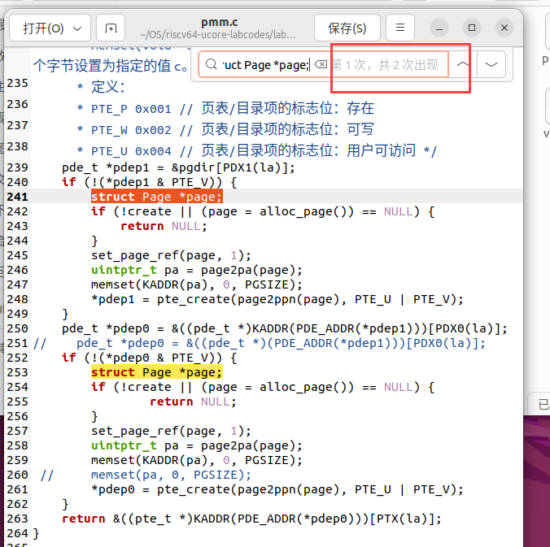
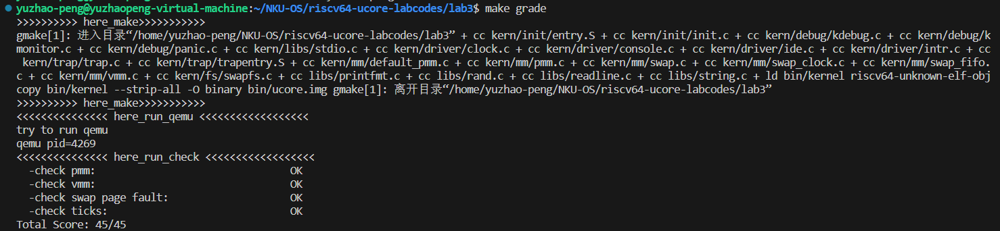

# Lab 3

彭钰钊 2110756	姜涵 2113630	王健行 2111065

### 一、实验要求：

- 基于markdown格式来完成，以文本方式为主
- 填写各个基本练习中要求完成的报告内容
- 列出你认为本实验中重要的知识点，以及与对应的OS原理中的知识点，并简要说明你对二者的含义，关系，差异等方面的理解（也可能出现实验中的知识点没有对应的原理知识点）
- 列出你认为OS原理中很重要，但在实验中没有对应上的知识点

### 二、知识点整理：

#### （一）缺页异常

指CPU访问的虚拟地址时， MMU没有办法找到对应的物理地址映射关系，或者与该物理页的访问权不一致而发生的异常。

#### （二）页面置换机制

主要考虑问题：如何判断内存中哪些是“常用”的页，哪些是“不常用”的页，把“常用”的页保持在内存中，在物理内存空闲空间不够的情况下，把“不常用”的页置换到硬盘上。

常见页替换算法：

- 先进先出（FIFO）算法：最简单的页面置换算法，通过维护一个页面队列，将最早进入内存的页面置换出去。当一个新的页面需要进入内存时，会将最早进入内存的页面置换出去。FIFO实现简单，但没有考虑页面的访问频率和重要性，可能会导致性能低下。
- 最近最久未使用（LRU）算法：根据页面的访问历史来进行页面置换。假设最近访问过的页面可能会在不久的将来再次访问，所以将最久未使用的页面置换出去。LRU算法的实现比较复杂，需要维护额外的数据结构（维护页面的访问顺序）。
- 最不常用（LFU）算法：根据页面的访问次数来进行页面置换。假设访问次数少的页面可能在未来也会较少被访问，所以将访问次数最少的页面置换出去。LFU 算法只考虑了频率问题，没考虑时间的问题，可能会导致频繁访问的页面被置换出去，从而影响性能。
- 时钟（Clock）算法：基于FIFO算法的改进算法。使用一个时钟指针来遍历页面队列，将时钟指针指向的页面置换出去。当一个新的页面需要进入内存时，时钟指针将继续前进，直到找到一个被访问位（或修改位）为0的页面，然后将该页面置换出去。时钟算法的优点是实现简单且效率较高。
- 改进的时钟（Enhanced Clock）页替换算法：在时钟算法的基础上为每一页的对应页表项内容中增加一位引用位和一位修改位，优先淘汰没有修改的页，减少磁盘操作次数。
- 最佳（OPT）算法**：**一种理论上的最佳页面置换算法，根据最佳策略来决定哪个页面应该被置换出去，即选择将在未来最长时间内不会被访问的页面置换出去。然而，由于无法预测未来的页面访问模式，所以最佳算法无法在实际中得到完美的实现。

#### （三）虚拟内存

- 【实验】通俗的说是指程序员或CPU“看到”的内存，并且虚拟内存不一定有其对应的物理内存
- 【理论】虚拟内存 = 物理内存 + 磁盘；虚拟内存的基本思想是： 每个程序拥有自己的地址空间，这个空间被分割成多个块，每一块称作页，每一页有连续的地址范围，这些页被映射到物理内存。

### 三、实验练习：

#### 练习1：理解基于FIFO的页面替换算法（思考题）

> 描述FIFO页面置换算法下，一个页面从被换入到被换出的过程中，会经过代码里哪些函数/宏的处理（或者说，需要调用哪些函数/宏），并用简单的一两句话描述每个函数在过程中做了什么？（为了方便同学们完成练习，所以实际上我们的项目代码和实验指导的还是略有不同，例如我们将FIFO页面置换算法头文件的大部分代码放在了`kern/mm/swap_fifo.c`文件中，这点请同学们注意）
>
> - 至少正确指出10个不同的函数分别做了什么？如果少于10个将酌情给分。我们认为只要函数原型不同，就算两个不同的函数。要求指出对执行过程有实际影响,删去后会导致输出结果不同的函数（例如assert）而不是cprintf这样的函数。如果你选择的函数不能完整地体现”从换入到换出“的过程，比如10个函数都是页面换入的时候调用的，或者解释功能的时候只解释了这10个函数在页面换入时的功能，那么也会扣除一定的分数

##### 总体流程

我们先梳理一下页面置换的总体流程。当我们需要访问某虚拟地址时，该虚拟地址对应一个物理页，这个页应该在物理内存中。操作系统给用户态的应用程序提供了一个虚拟的“大容量”内存空间，但实际的物理内存空间又没有那么大。所以操作系统就“瞒着”应用程序，只把应用程序中“常用”的数据和代码放在有限物理内存中，而不常用的数据和代码放在了硬盘这样的存储介质上。  

在FIFO算法中，操作系统需要跟踪队列中内存中的所有页面，最近进入内存的页面在后面，最先到达的页面在前面。为了实现FIFO PRA，我们需要管理所有可交换的页面。因此，我们使用了一个链表，按照进入内存的时间先后顺序将这些页面链接到`pra_list_head`中。当物理内存已满，想访问的地址映射的page在磁盘中，就需要将需要进入的页面与最早进入内存的页面进行替换，保证访存的正常进行。

##### **部分结构** 

在整个页面置换过程中，部分数据结构起到重要的作用。例如：

```C
 struct vma_struct {
     struct mm_struct *vm_mm; // the set of vma using the same PDT 
     uintptr_t vm_start;      // start addr of vma      
     uintptr_t vm_end;        // end addr of vma, not include the vm_end itself
     uint_t vm_flags;        // flags of vma
     list_entry_t list_link;  // linear list link which sorted by start addr of vma
 };
 
 struct mm_struct {
     list_entry_t mmap_list; // linear list link which sorted by start addr of vma
     struct vma_struct *mmap_cache; // current accessed vma, used for speed purpose
     pde_t *pgdir;          // the PDT of these vma
     int map_count;         // the count of these vma
     void *sm_priv;         // the private data for swap manager
 };
```

`vma_struct`(虚拟内存区域)用来描述一段连续的虚拟内存，`vm_start`与`vm_end`描述了这段内存的起止地址位置，`list_link`是关联结构体链表的结构，`vm_flags`是这段内存对应的权限。在虚拟内存中，多个虚拟内存区域（VMA）可以共享相同的内存，它们就会指向相同的 `mm_struct`。

`mm_struct`(内存管理)把与自己有映射的`vma_struct`进行保存，并记录当前访问的`vma_struct`以提高访问速度。`pgdir`则指向虚拟地址空间的页目录表，`map_count`则跟踪管理的VMA数量。

两个数据结构相辅相成，辅助管理虚拟内存。

页面交换中，ucore使用了结构体`swap_manager`辅助进行。

在我们的ucore中将页面替换打包成一个页面替换管理器，即`swap.h`和`swap.c`，我们在实现任意页面替换算法之后只需要修改页面替换管理器中挂载的替换算法部分即可。

```C
 int
 swap_init(void)
 {
      swapfs_init();

      // Since the IDE is faked, it can only store 7 pages at most to pass the test
      if (!(7 <= max_swap_offset &&
         max_swap_offset < MAX_SWAP_OFFSET_LIMIT)) {
         panic("bad max_swap_offset %08x.\n", max_swap_offset);
      }
 
      sm = &swap_manager_clock;//use first in first out Page Replacement Algorithm
      int r = sm->init();
      
      if (r == 0)
      {
           swap_init_ok = 1;
           cprintf("SWAP: manager = %s\n", sm->name);
           check_swap();
      }
 
      return r;
 }
```

上面给出的是本次实验代码`swap.c`中的替换管理器初始化函数，其中使用的算法是时钟页替换算法——`sm = &swap_manager_clock;`我们在使用FIFO时，这里挂载的应该是`&swap_manager_fifo`。

##### **处理过程**

我们在此实现的是一种消极的换出策略，在调用`alloc_pages` 获取空闲页时，发现无法从物理内存页的分配器中获得页，就调用`swap_out`函数完成页的换出。

在发生页面异常时，会由**`pgfault_handler`函数**进行处理。该函数打印有关错误信息后，调用**`do_pgfault`函数**进行进一步处理。

> int do_pgfault(struct mm_struct *mm, uint_t error_code, uintptr_t addr)

`do_pgfault`函数的作用是，将异常的未被映射的地址映射到物理页上，在练习3中有着较为详细的说明。

在查找页表项时，使用到**`get_pte`函数**来查找虚拟地址对应的页表项，在页面换入与换出中均发挥重要作用。如果 `*ptep` 为0，说明页表项不存在；如果对应页表不存在，将会创建一个新的页表并返回相应的 PTE 指针。同时需要使用**`pgdir_alloc_page`函数**分配物理页面来存储数据。

若查到了页表项，说明页面已经在内存中，但是可能是一个交换条目（swap entry）。在这种情况下，需要将使用**`swap_in`函数**，将页面从磁盘加载到内存；使用**`page_Insert`函数**，建立物理地址与虚拟地址的映射；使用**`swap_map_swappable`函数**，标记页面为可交换，将该页作为最近被用到的页面，添加到序列的队尾。

###### 页面换入

重点在于`swap_in`函数。该函数完成页面换入工作，将页面从磁盘加载到内存，使用复制的方式完成。

```C
 int swap_in(struct mm_struct *mm, uintptr_t addr, struct Page **ptr_result)
 {
      struct Page *result = alloc_page();
      assert(result!=NULL);
      pte_t *ptep = get_pte(mm->pgdir, addr, 0);
      int r;
      if ((r = swapfs_read((*ptep), result)) != 0)
         assert(r!=0);
      cprintf("swap_in: load disk swap entry %d with swap_page in vadr 0x%x\n", (*ptep)>>8, addr);
      *ptr_result=result;
      return 0;
 }
```

函数先调用了`alloc_page()`函数，尝试得到一个空页，为此可能调用`swap_out`页面换出函数，在物理页不足时通过替换得到新的页。

> \#define alloc_page() alloc_pages(1)

`alloc_page()`是分配一页，即为`alloc_pages(1)`。`alloc_pages`函数作用是分配多页：

```C
 struct Page *alloc_pages(size_t n) {
     struct Page *page = NULL;
     bool intr_flag;
     while (1) {
         local_intr_save(intr_flag);
         { page = pmm_manager->alloc_pages(n); }
         local_intr_restore(intr_flag);
         if (page != NULL || n > 1 || swap_init_ok == 0) break;
         extern struct mm_struct *check_mm_struct;
         swap_out(check_mm_struct, n, 0);
     }
     return page;
 }
```

**`local_intr_save`**与**`local_intr_restore`**这两个函数用于保存和恢复中断状态，以确保在分配内存时不会被中断打断。具体分配则调用了pmm_manager中的**`alloc_pages`函数**，该函数在lab2中已介绍。

if里的三个条件较为重要，swap_init_ok保证**`swap_init`函数**初始化结束，表示可以使用swap机制；page不为空说明分配成功，不必进行页面的置换；由于swap机制一次只能换出去一个页，因此若需要分配的页面数大于1直接break。否则，说明需要将页面进行换出，需要调用**`swap_out`函数**。`swap_out`函数较复杂，作用为将内存中最早的页面写入磁盘以腾出空间，后续详细解释。

1. **`assert(result != NULL);`**：使用断言确保分配页面成功，如果分配失败，则会触发断言，表明出现了严重错误。`get_pte` 函数在前面已经说明。
2. **`swapfs_read` 函数**，从磁盘中读取数据，并将数据存储在 `result` 页面中。函数的参数包括要读取的磁盘交换区的位置，即 `(*ptep)` 中存储的值。

###### 页面换出

阅读以上内容，我们知道`swap_out` 函数在分配页面时使用，在物理内存不足时实行页面换出操作。

```C++
int swap_out(struct mm_struct *mm, int n, int in_tick)
{
     int i;
     for (i = 0; i != n; ++ i)
     {
          uintptr_t v;
          //struct Page **ptr_page=NULL;
          struct Page *page;
          int r = sm->swap_out_victim(mm, &page, in_tick);
          if (r != 0) {
                    cprintf("i %d, swap_out: call swap_out_victim failed\n",i);
                  break;
          }          
          v=page->pra_vaddr; 
          pte_t *ptep = get_pte(mm->pgdir, v, 0);
          assert((*ptep & PTE_V) != 0);
          if (swapfs_write( (page->pra_vaddr/PGSIZE+1)<<8, page) != 0) {
                    cprintf("SWAP: failed to save\n");
                    sm->map_swappable(mm, v, page, 0);
                    continue;
          }
          else {
                    cprintf("swap_out: i %d, store page in vaddr 0x%x to disk swap entry %d\n", i, v, page->pra_vaddr/PGSIZE+1);
                    *ptep = (page->pra_vaddr/PGSIZE+1)<<8;
                    free_page(page);
          }
          tlb_invalidate(mm->pgdir, v);
     }
     return i;
}
```

该函数核心在于调用 **`sm->swap_out_victim` 函数**，选择要置换的牺牲者页面。并将结果存储在 `page` 变量中；随后获取虚拟地址v对应的页表项的指针 ptep，使用断言检查页面的合法性，并调用**`swapfs_write` 函数**，将被选为牺牲的页面内容写入到磁盘交换区。`swapfs_write` 的参数包括磁盘交换区的偏移位置， `(page->pra_vaddr / PGSIZE + 1) << 8` 构造了`swap_entry_t`以计算出磁盘交换区的位置，具体实现交换时调用**`swap_offset`函数**处理`swap_entry_t`后，乘以`PAGE_NSECT`得到占用的扇区数，最终利用`ide_write_secs`函数将页写入磁盘。

在实现`_fifo_swap_out_victim`时，之前的维护`pra_list_head`起到重要作用，链表第一个页面即为最早进入内存的页面，作为受害者页面换出；具体实现时利用**`list_prev`函数**获取链表头节点信息，用**`page2pa`**将page转换为物理地址。

#### 练习2：深入理解不同分页模式的工作原理（思考题）

> get_pte()函数（位于`kern/mm/pmm.c`）用于在页表中查找或创建页表项，从而实现对指定线性地址对应的物理页的访问和映射操作。这在操作系统中的分页机制下，是实现虚拟内存与物理内存之间映射关系非常重要的内容。
>
> - get_pte()函数中有两段形式类似的代码， 结合sv32，sv39，sv48的异同，解释这两段代码为什么如此相像。
> - 目前get_pte()函数将页表项的查找和页表项的分配合并在一个函数里，你认为这种写法好吗？有没有必要把两个功能拆开？

get_pte()函数的代码如下：

```C++
pte_t *get_pte(pde_t *pgdir, uintptr_t la, bool create) {
    pde_t *pdep1 = &pgdir[PDX1(la)];
    if (!(*pdep1 & PTE_V)) {
        struct Page *page;
        if (!create || (page = alloc_page()) == NULL) {
            return NULL;
        }
        set_page_ref(page, 1);
        uintptr_t pa = page2pa(page);
        memset(KADDR(pa), 0, PGSIZE);
        *pdep1 = pte_create(page2ppn(page), PTE_U | PTE_V);
    }
    pde_t *pdep0 = &((pde_t *)KADDR(PDE_ADDR(*pdep1)))[PDX0(la)];
//    pde_t *pdep0 = &((pde_t *)(PDE_ADDR(*pdep1)))[PDX0(la)];
    if (!(*pdep0 & PTE_V)) {
            struct Page *page;
            if (!create || (page = alloc_page()) == NULL) {
                    return NULL;
            }
            set_page_ref(page, 1);
            uintptr_t pa = page2pa(page);
            memset(KADDR(pa), 0, PGSIZE);
 //           memset(pa, 0, PGSIZE);
            *pdep0 = pte_create(page2ppn(page), PTE_U | PTE_V);
    }
    return &((pte_t *)KADDR(PDE_ADDR(*pdep0)))[PTX(la)];
}
```

**（1）结合sv32，sv39，sv48的异同，解释这两段代码为什么如此相像**

**代码分析：** 该函数根据给定的页目录表（`pgdir`）、线性地址（`la`）和一个布尔值（`create`）来判断是否需要分配页面。函数的主要作用是查找给定线性地址 `la` 对应的页表项，如果该页表项不存在，根据 `create` 参数的值来决定是否创建页表。具体步骤如下：

1、通过 `PDX1(la)` 来获取一级页表项的索引，然后在页目录表 `pgdir` 中查找对应的一级页表项 `pdep1`。

2、如果一级页表项不存在（`!(*pdep1 & PTE_V)`），则说明需要创建一级页表。在这种情况下，分配一个物理页面 `page` 并将其标记为已被引用（`set_page_ref(page, 1)`）。

3、接下来，获取该物理页面的起始物理地址 `pa`，然后使用 `memset` 函数将该物理页面的内容清零，以确保新分配的页表是干净的。

4、接着，创建一个新的页表项并设置它的属性（`PTE_U` 和 `PTE_V`），将该页表项赋值给一级页表项 `*pdep1`，以创建一级页表。

5、然后，通过 `PDX0(la)` 获取二级页表项的索引，然后在一级页表中查找对应的二级页表项 `pdep0`。

6、如果二级页表项不存在（`!(*pdep0 & PTE_V)`），则需要创建二级页表，步骤与创建一级页表相似。

7、最后，通过 `PTE_ADDR(pte)` 宏计算出虚拟地址 `la` 对应的页表项的物理地址，并将其返回。

**sv32、sv39 和 sv48 的异同点：**

1. sv32 是 RISC-V 的 32 位架构，采用两级页表结构。一级页表包含指向二级页表的指针，而二级页表包含页表项。sv32 的页表项大小是 4 字节。
2. sv39 是 RISC-V 的 64 位架构，采用三级页表结构。一级页表包含指向二级页表的指针，二级页表包含指向三级页表的指针，而三级页表包含页表项。sv39 的页表项大小是 8 字节。
3. sv48 也是 RISC-V 的 64 位架构，采用四级页表结构。类似于 sv39，它包含更多的页表级别，每个级别都包含指向下一级页表的指针，最后一级包含页表项。sv48 的页表项大小也是 8 字节。

尽管这些架构在页表级别和页表项大小上有所不同，但页表的创建和管理过程大致相同，因此代码具有相似性。在不同的架构下，只需根据页表级别和页表项大小的差异来调整具体的操作和数据结构。

综合以上代码分析及sv32、sv39 和 sv48 异同点分析，可以得出结论：`get_pte`  函数中的两段相似代码用于处理页表的创建，具体分别是创建一级页表项和二级页表项。这种相似性的原因是因为这段代码是处理分页机制的基本操作，而  sv32、sv39 和 sv48 也采用了相似的多级页表结构。

**(2)目前get_pte()函数将页表项的查找和页表项的分配合并在一个函数里，你认为这种写法好吗？有没有必要把两个功能拆开？**

这种写法具有以下优点：

1. 简化代码结构：将查找和分配合并在一起可以减少代码复杂性，使代码更易维护、结构更紧凑、更容易理解。
2. 性能考虑：合并在一起可以减少函数调用开销，因为两个操作通常是紧密相关的，并且在同一个上下文中执行。这可以提高性能，尤其是在涉及大量页表项查找和分配的情况下。
3. 代码一致性：将查找和分配合并在一个函数中可以确保这两个操作的一致性，因为它们是在同一个函数中执行的，避免了不同函数之间的不一致性。
4. 避免重复代码（在我们本次实验中并无明显体现）：如果将查找和分配分成两个函数，那么这两个函数可能会包含大量重复的代码，因为它们需要进行相似的操作，如检查页表项是否存在、分配物理页面、设置页表项等。

由以上分析**合并页表项查找和分配的方式是合理的**，一般来说如果两个操作在代码中的不同地方都有用到，把它们分开更有利于代码的模块化和可读性、可以得到更好的代码组织、更容易的单元调用、更容易地复用；而如果这两个操作通常在一起使用，并且没有进一步的抽象需要，那么合并是比较好的选择。

在我们的pmm.c文件中，页表项分配 `struct Page *page;`只出现两次，且均在页表项查找之后，这两个操作一起使用，故我们认为**没有必要把两个功能拆开**。



#### 练习3：给未被映射的地址映射上物理页（需要编程）

> 补充完成do_pgfault（mm/vmm.c）函数，**给未被映射的地址映射上物理页**。设置访问权限的时候需要参考页面所在 VMA 的权限，同时需要注意映射物理页时需要操作内存控制 结构所指定的页表，而不是内核的页表。
>
> 请在实验报告中简要说明你的设计实现过程。请回答如下问题：
>
> - 请描述页目录项（Page Directory Entry）和页表项（Page Table Entry）中组成部分对ucore实现页替换算法的潜在用处。
> - 如果ucore的缺页服务例程在执行过程中访问内存，出现了页访问异常，请问硬件要做哪些事情？
>   - 数据结构Page的全局变量（其实是一个数组）的每一项与页表中的页目录项和页表项有无对应关系？如果有，其对应关系是啥？

我们首先分析`do_pgfault`函数，该函数的作用是给未被映射的地址映射上物理页。具体而言，当程序访问"不对应物理内存页帧的虚拟内存地址"时，CPU应当抛出`Page Fault`这个异常，接着把Page Fault分发给`kern/mm/vmm.c`的`do_pgfault()`函数并尝试进行页面置换。

`do_pgfault`函数接收三个参数：内存管理结构 `mm`、错误代码 `error_code` 和引发页面错误的线性地址 `addr` 。首先尝试查找包含给定地址 `addr` 的虚拟内存区域（`vma`），并将跟踪页面错误数量的全局变量`pgfault_num` 增加 1。

```C++
int
do_pgfault(struct mm_struct *mm, uint_t error_code, uintptr_t addr) {
    int ret = -E_INVAL;
    //try to find a vma which include addr
    struct vma_struct *vma = find_vma(mm, addr);

    pgfault_num++;
```

接着判断地址是否有效（是否找到匹配的 `vma` 或是否 `addr` 超出了有效范围）。

```C++
  //If the addr is in the range of a mm's vma?
    if (vma == NULL || vma->vm_start > addr) {
        cprintf("not valid addr %x, and  can not find it in vma\n", addr);
        goto failed;
    }
```

计算 `perm` 权限，根据 `vma` 的属性 `VM_WRITE`，确定是否允许写入，并设置相应的权限标志。

```C++
 uint32_t perm = PTE_U;
    if (vma->vm_flags & VM_WRITE) {
        perm |= (PTE_R | PTE_W);
    }
```

调整地址为页面大小的倍数、获取页表项指针 `ptep`

```C++
    addr = ROUNDDOWN(addr, PGSIZE);

    ret = -E_NO_MEM;

    pte_t *ptep=NULL;
    
    //获取页表项的指针，pgdir 是页目录的基址
    ptep = get_pte(mm->pgdir, addr, 1); 
```

若PTE不存在则为页表分配物理内存，若PTE存在则判断是否启用交换机制 `swap_init_ok` ，若未启用则进入else分支，否则执行交换操作（练习3要实现的代码）。

执行交换操作我们需要：

（1）分配一个内存页并从磁盘上的交换文件加载数据到该内存页，参考`swap_in(mm, addr, &page)`函数；

设计为：` swap_in(mm, addr, &page);`

（2）建立内存页 `page` 的物理地址和线性地址 `addr` 之间的映射，参考`page_insert)`函数：

```C++
//kern/mm/pmm.c
int page_insert(pde_t *pgdir, struct Page *page, uintptr_t la, uint32_t perm) {
    pte_t *ptep = get_pte(pgdir, la, 1);
    if (ptep == NULL) {
        return -E_NO_MEM;
    }
    page_ref_inc(page);
    if (*ptep & PTE_V) {
        struct Page *p = pte2page(*ptep);
        if (p == page) {
            page_ref_dec(page);
        } else {
            page_remove_pte(pgdir, la, ptep);
        }
    }
    *ptep = pte_create(page2ppn(page), PTE_V | perm);
    tlb_invalidate(pgdir, la);
    return 0;
}
```

设计为： ` page_insert（mm->pgdir,page,addr,perm);`

（3）将页面标记为可交换，参考`swap_map_swappable`函数：

```C++
//kern/mm/swap.c
int
swap_map_swappable(struct mm_struct *mm, uintptr_t addr, struct Page *page, int swap_in)
{
     return sm->map_swappable(mm, addr, page, swap_in);
}
```

设计为：`swap_map_swappable(mm, addr, page, 0);`

（4）跟踪页面映射的线性地址：`page->pra_vaddr = addr;`

**最终填写后，判断PTE是否存在及是否启用交换机制及相应操作如下**：

```C++
 //kern/mm/vmm.c
 if (*ptep == 0) {
        if (pgdir_alloc_page(mm->pgdir, addr, perm) == NULL) {
            cprintf("pgdir_alloc_page in do_pgfault failed\n");
            goto failed;
        }
    } else {
        if (swap_init_ok) {
            struct Page *page = NULL;
            // 你要编写的内容在这里，请基于上文说明以及下文的英文注释完成代码编写
            
            swap_in(mm, addr, &page);//分配一个内存页并从磁盘上的交换文件加载数据到该内存页
            page_insert(mm->pgdir,page,addr,perm);//建立内存页 page 的物理地址和线性地址 addr 之间的映射
            swap_map_swappable(mm, addr, page, 1);//将页面标记为可交换
            page->pra_vaddr = addr;//跟踪页面映射的线性地址
            
        } else {
            cprintf("no swap_init_ok but ptep is %x, failed\n", *ptep);
            goto failed;
        }
   }
```

**（1）请描述页目录项（Page Directory Entry）和页表项（Page Table Entry）中组成部分对ucore实现页替换算法的潜在用处。**

sv39的页目录表项和页表项结构相似，如下图所示，第 9-0 位共10位描述映射的状态信息：

.png)

其中

- D：即 Dirty ，如果 D=1 表示自从上次 D 被清零后，有虚拟地址通过这个页表项进行写入。
- A，即 Accessed，如果 A=1 表示自从上次 A 被清零后，有虚拟地址通过这个页表项进行读、或者写、或者取指。

可以发现`PTE_A` 表示内存页是否被访问过，`PTE_D` 表示内存页是否被修改过。借助`PTE_A`标志位可以实现Clock页替换算法，借助`PTE_A`和`PTE_D`可以实现Enhanced Clock 页面替换算法。

**（2）如果ucore的缺页服务例程在执行过程中访问内存，出现了页访问异常，请问硬件要做哪些事情？**

产生页访问异常后，CPU把引起页访问异常的线性地址装到寄存器CR2中，并设置错误代码errorCode说明页访问异常的类型，然后触发 `Page Fault` 异常。

  **(3)数据结构Page的全局变量（其实是一个数组）的每一项与页表中的页目录项和页表项有无对应关系？如果有，其对应关系是啥？**

有关系，数据结构page是最低级的页表，目录项是一级页表，存储的内容是页表项的起始地址（二级页表），而页表项是二级页表，存储的是每个页表的开始地址，这些内容之间的关系是通过线性地址高低位不同功能的寻址体现的。

#### 练习4：补充完成Clock页替换算法（需要编程）

> 通过之前的练习，相信大家对FIFO的页面替换算法有了更深入的了解，现在请在我们给出的框架上，填写代码，实现 Clock页替换算法（mm/swap_clock.c）。(提示:要输出curr_ptr的值才能通过make grade)
>
> 请在实验报告中简要说明你的设计实现过程。请回答如下问题：
>
> - 比较Clock页替换算法和FIFO算法的不同。

**算法设计**

我们在知识点整理中已经简单介绍了什么是时钟替换算法（即Clock页替换算法），其关键在于一个数据结构——循环链表；一个关键变量——访问位（visited）；一个指针——指向当前被检查页面的指针以及关键的替换策略。

- 循环链表与访问位

Clock算法通过维护一个循环链表来存储可替换页面，对于页面的数据结构Page中我们有一个关键变量visited（代表访问位）。

访问位解释：访问位是用于表示此页表项对应的页当前是否被访问过。

- 替换策略

当进行页面替换时对当前指针指向的页所对应的页表项进行查询，如果访问位为“0”，则淘汰该页；如果访问位为“1”，则将该页表项的此位置“0”，继续访问下一个页。

我们稍微分析一下这个过程，同时**比较Clock页替换算法和FIFO算法的不同**：

- 访问位如果是0，则表示该页面未被访问，可以把它丢出去；
- 访问位如果是1，则表示该页面被访问，那么我们将该位重置，即清零，这个页面使用了“免死金牌”逃过一劫；
- 具体替换流程：通过当前指针从头遍历循环链表，使当前指针指向被检查页面，如果访问位为“0”，则淘汰该页；如果访问位为“1”，则将该页表项的此位置“0”，继续访问下一个页。

总的来说，该算法近似地体现了 LRU 的思想，且易于实现，开销少，需要硬件支持来设置访问位。时钟页替换算法在本质上与 FIFO 算法是类似的，不同之处是在**时钟页替换算法中跳过了访问位为 1 的页**。

在实现Clock页替换算法时，我们参考实验代码中已经实现的FIFO算法，在现有框架上填写实现Clock页替换算法的代码，首先我们进入文件`swap_clock.c`中查看，首先我们声明了两个list_entry_t类型的变量，一个是pra_list_head，即可交换页面（按时间顺序）链表头；另一个是指向当前被检查页面的指针curr_ptr。接下来便是我们要实现的相关函数：

**初始化函数**

在`_clock_init_mm`函数中我们将循环链表初始化为空链表，使当前指针curr_ptr指向链表头。

```C
static int
_clock_init_mm(struct mm_struct *mm)
{     
     /*LAB3 EXERCISE 4: YOUR CODE*/ 
     // 初始化pra_list_head为空链表
     list_init(&pra_list_head);
     // 初始化当前指针curr_ptr指向pra_list_head，表示当前页面替换位置为链表头
     curr_ptr = &pra_list_head;
     // 将mm的私有成员指针指向pra_list_head，用于后续的页面替换算法操作
     mm->sm_priv = &pra_list_head;
     //cprintf(" mm->sm_priv %x in fifo_init_mm\n",mm->sm_priv);
     return 0;
}
```

**页面访问检查与链表维护函数**

在`_clock_map_swappable`函数中我们将可替换页面插入循环链表中的末尾，并且将页面的访问位visited置为1，表示当前页面已被访问。

```C
static int
_clock_map_swappable(struct mm_struct *mm, uintptr_t addr, struct Page *page, int swap_in)
{
    list_entry_t *entry=&(page->pra_page_link);
 
    assert(entry != NULL && curr_ptr != NULL);
    //record the page access situlation
    /*LAB3 EXERCISE 4: YOUR CODE*/ 
    // link the most recent arrival page at the back of the pra_list_head qeueue.
    // 将页面page插入到页面链表pra_list_head的末尾
    list_entry_t *head=(list_entry_t*) mm->sm_priv;
    list_add(head->prev, entry);
    // 将页面的visited标志置为1，表示该页面已被访问
    page->visited  = 1;
    return 0;
}
```

**页面替换函数**

在`_clock_swap_out_victim`函数中，我们将开始时钟盘轮转，即循环遍历循环链表以筛选可替换页面。如果当前页面未被访问，即访问位为0，则将该页面换出（从循环链表中删去该页面），跳出本轮检查；而如果当前页面被访问，即访问位为1，则将该页面在本次检查时重置，即将访问位置0，继续遍历。

```C
static int
_clock_swap_out_victim(struct mm_struct *mm, struct Page ** ptr_page, int in_tick)
{
     list_entry_t *head=(list_entry_t*) mm->sm_priv;
         assert(head != NULL);
     assert(in_tick==0);
     /* Select the victim */
     //(1)  unlink the  earliest arrival page in front of pra_list_head qeueue
     //(2)  set the addr of addr of this page to ptr_page
    struct Page *curr_page;
    while (1) {
        /*LAB3 EXERCISE 4: YOUR CODE*/ 
        // 编写代码
        // 遍历页面链表pra_list_head，查找最早未被访问的页面
        if (curr_ptr == head){  // 由于是将页面page插入到页面链表pra_list_head的末尾，所以pra_list_head制起标识头部的作用，跳过
            curr_ptr = list_next(curr_ptr);
        }
        // 获取当前页面对应的Page结构指针
        curr_page = le2page(curr_ptr, pra_page_link);
        // 如果当前页面未被访问，则将该页面从页面链表中删除，并将该页面指针赋值给ptr_page作为换出页面
        if (curr_page->visited != 1){
            *ptr_page = curr_page;
            cprintf("curr_ptr %p\n",curr_ptr);
            list_del(curr_ptr);
            break;
        }
        // 如果当前页面已被访问，则将visited标志置为0，表示该页面已被重新访问
        if (curr_page->visited == 1){
            curr_page->visited = 0;
        }
        curr_ptr = list_next(curr_ptr);
    }
    return 0;
}
```

到此我们实现了本次实验的两个编码部分。我们运行make grade结果如下所示：



#### 练习5：阅读代码和实现手册，理解页表映射方式相关知识（思考题）

> 如果我们采用”一个大页“ 的页表映射方式，相比分级页表，有什么好处、优势，有什么坏处、风险？

##### 优势

减少页表项的数量： 一个大页的页表项覆盖了更多的物理内存，因此需要更少的页表项来管理相同的内存。这降低了页表的大小，减少了页表管理的开销。

更高的内存访问性能：使用大页时，页表深度降低，减少了虚拟地址到物理地址的映射查找次数。此外，由于减少了页表项的数量，访问页表的开销更小，可以加快内存访问速度。

更高的TLB命中率：使用大页时，页表项的数量降低，单一页表项对应的虚拟空间增大，因此TLB命中率会提高

##### 风险

内存内部碎片：每个页表项要覆盖更多的虚拟地址空间，可能导致一些未使用的地址空间被浪费。

粒度过大：大页表中单一页表项对应更大的空间，这可能不适用于所有应用程序，因为某些应用程序可能需要更细粒度的内存管理。

Page fault开销过大：出现页面错误时，需要将大页从磁盘加载到内存中，这可能导致更长的页面错误处理时间。

### Github链接

https://github.com/Yuzhao-P/NKU-2023OS-GroupWork

