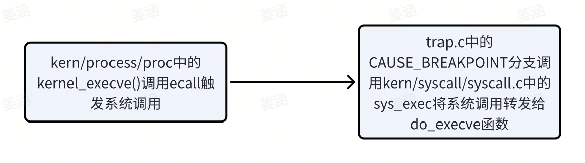
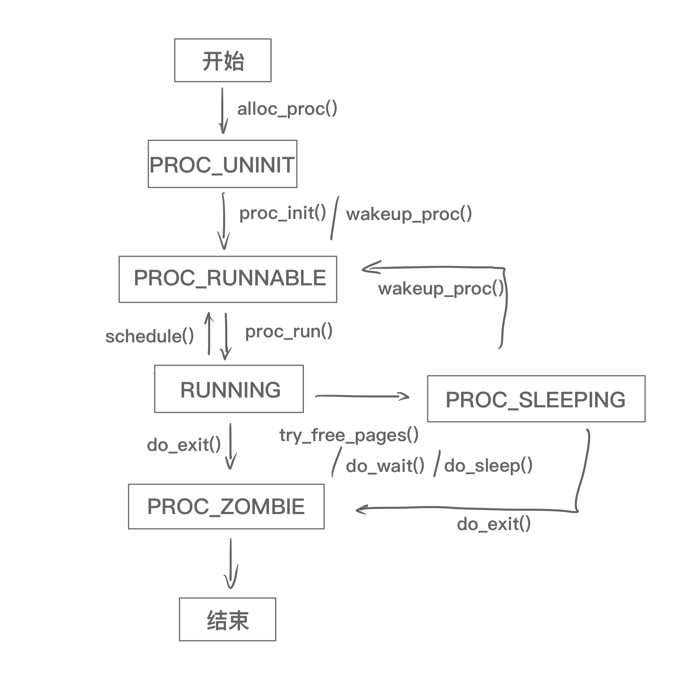

# Lab 5

彭钰钊 2110756	姜涵 2113630	王健行 2111065

### 一、实验要求：

- 基于markdown格式来完成，以文本方式为主
- 填写各个基本练习中要求完成的报告内容
- 列出你认为本实验中重要的知识点，以及与对应的OS原理中的知识点，并简要说明你对二者的含义，关系，差异等方面的理解（也可能出现实验中的知识点没有对应的原理知识点）
- 列出你认为OS原理中很重要，但在实验中没有对应上的知识点

### 二、知识点整理：

1. 系统调用:操作系统提供给用户程序,让用户程序使用操作系统提供的服务的接口。
   1. 在用户态进行系统调用的核心操作是通过内联汇编进行`ecall`环境调用，产生一个trap, 进入S mode进行异常处理。
2. **fork & execve**

fork： `fork`系统调用用于创建一个新的进程，称为子进程。子进程是父进程的副本，它从父进程那里继承了许多属性，包括内存内容、文件描述符、环境变量等。

execve： `execve`系统调用用于在当前进程中执行一个新的程序。它会用一个新的程序替换当前进程的内存空间，代码段，数据段等，execve为内核级系统调用。

简单说就是：

| fork | execve |
| ---- | ------ |
| 复制 | 覆盖   |

因此，一般的进程创建和程序加载的模式是先使用 `fork` 创建一个新的进程，然后在子进程中使用 `execve` 来加载新的程序。这样做的好处是可以保留原来进程的状态（如文件描述符、信号处理器等），同时执行一个全新的程序。

### 三、实验练习：

#### **练习0：填写已有实验**

> 本实验依赖实验2/3/4。请把你做的实验2/3/4的代码填入本实验中代码中有“LAB2”/“LAB3”/“LAB4”的注释相应部分。注意：为了能够正确执行lab5的测试应用程序，可能需对已完成的实验2/3/4的代码进行进一步改进。

本次实验相较于过去的填写有所不同——需要对原有代码进行更新

在`alloc_proc`函数中，我们相较于Lab 4新增了几个成员变量：

```C
 proc->wait_state = 0;  // 初始化进程等待状态
 proc->cptr = proc->optr = proc->yptr = NULL;  // 设置进程指针
```

在`do_fork`函数中，我们相较于Lab 4做出如下修改：

首先在创建进程（分配进程）后添加`assert(current->wait_state == 0);` 确保进程处在等待状态；然后再进行下面这些修改——将原先简单的进程计数和添加改为`set_links`函数，设置进程链接，即

```C
 // list_add(&proc_list, &proc->list_link);  // 这才是正确的打开方式（bushi）
 // nr_process++;  // 更新进程数
 set_links(proc);  // 设置进程链接
```

#### **练习1: 加载应用程序并执行（需要编码）**

> **do_execv**函数调用`load_icode`（位于kern/process/proc.c中）来加载并解析一个处于内存中的ELF执行文件格式的应用程序。你需要补充`load_icode`的第6步，建立相应的用户内存空间来放置应用程序的代码段、数据段等，且要设置好`proc_struct`结构中的成员变量trapframe中的内容，确保在执行此进程后，能够从应用程序设定的起始执行地址开始执行。需设置正确的trapframe内容。
>
> 请在实验报告中简要说明你的设计实现过程。
>
> - 请简要描述这个用户态进程被ucore选择占用CPU执行（RUNNING态）到具体执行应用程序第一条指令的整个经过。

**设计思路：**

在本部分中，我们需要完成的是`load_icode`中的第六步，而该函数被`do_execv`调用，把新的程序加载到当前进程里（程序已经存在于内存空间中），给用户进程建立一个能够正常运行的用户环境，涉及页表、用户栈等。

```C
    //(6) setup trapframe for user environment
    struct trapframe *tf = current->tf;
    // Keep sstatus
    uintptr_t sstatus = tf->status;
    memset(tf, 0, sizeof(struct trapframe));
    /* LAB5:EXERCISE1 YOUR CODE
     * should set tf->gpr.sp, tf->epc, tf->status
     * NOTICE: If we set trapframe correctly, then the user level process can return to USER MODE from kernel. So
     *          tf->gpr.sp should be user stack top (the value of sp)
     *          tf->epc should be entry point of user program (the value of sepc)
     *          tf->status should be appropriate for user program (the value of sstatus)
     *          hint: check meaning of SPP, SPIE in SSTATUS, use them by SSTATUS_SPP, SSTATUS_SPIE(defined in risv.h)
     */
    tf->gpr.sp = USTACKTOP; // 设置f->gpr.sp为用户栈的顶部地址
    tf->epc = elf->e_entry; // 设置tf->epc为用户程序的入口地址
    tf->status = (read_csr(sstatus) & ~SSTATUS_SPP & ~SSTATUS_SPIE); // 根据需要设置 tf->status 的值，清除 SSTATUS_SPP 和 SSTATUS_SPIE 位

    ret = 0;
```

**问题回答：**

- 用户进程`userproc`的创建过程如下
  - 在`proc_init`中创建内核线程`initproc`时，用到了`kernel_thread(init_main, NULL, 0); `调用`init_main`。
  - 在`init_main` 中，用到语句为`kernel_thread(user_main, NULL, 0);` 调用`user_main`。
  - 在`user_main`中，用到 `KERNEL_EXECVE2(TEST, TESTSTART, TESTSIZE);`这条语句调用了`kernel_execve`函数，用于加载并执行一个新的程序，这个函数内调用了`SYS_exec`命令。结合实验指导书，我们可知第一个用户进程是由第二个内核线程`initproc`通过把`hello`应用程序执行码覆盖到`initproc`的用户虚拟内存空间来创建的。参数`TEST`为进程名，`TESTSTART`和`TESTSIZE`分别为执行码的起始位置和执行码的大小。kernel_execve 把这两个变量作为 SYS_exec 系统调用的参数，让 ucore 来创建此用户进程。
  - 当 ucore 收到此系统调用后，将依次调用如下函数：`vector128(vectors.S)`-->`__alltraps(trapentry.S)`-->`trap(trap.c)`-->`trap_dispatch(trap.c)`--->`syscall(syscall.c)`-->`sys_exec(syscall.c)` -->`do_execve(proc.c)`。`do_execve`函数的作用在指导书中有详细说明。
  - > do_execve函数来完成用户进程的创建工作，将用户态程序加载到内核态。此函数的主要工作流程如下：
    >
    > - 首先为加载新的执行码做好用户态内存空间清空准备。如果mm不为NULL，则设置页表为内核空间页表，且进一步判断mm的引用计数减1后是否为0，如果为0，则表明没有进程再需要此进程所占用的内存空间，为此将根据mm中的记录，释放进程所占用户空间内存和进程页表本身所占空间。最后把当前进程的mm内存管理指针为空。由于此处的initproc是内核线程，所以mm为NULL，整个处理都不会做。
    > - 接下来的一步是加载应用程序执行码到当前进程的新创建的用户态虚拟空间中。这里涉及到读ELF格式的文件，申请内存空间，建立用户态虚存空间，加载应用程序执行码等。load_icode函数完成了整个复杂的工作。

  - 在`load_icode`中，我们完成了对用户线程内存空间的初始化，堆栈的设置，并将 ELF 可执行文件进行了加载。（加载这一步，子进程还没创建！）随后，通过`current->tf`修改了当前的 `trapframe`，使得中断返回的时候能够切换到用户态，并且可以正确地将控制权转移到应用程序的入口。
  - 当上述工作结束之后，`kernel_thread`函数内调用了`do_fork`。`do_fork`内调用`wake_proc`完成进程创建，并让进程处于就绪状态（RUNNABLE），等待调度执行。

- `initproc`在创建用户进程后调用`do_wait`函数，等待就绪状态（RUNNABLE）的子进程出现进行调度，调用`schedule`函数。
- `schedule`函数被激活后调用`proc_run`函数运行新的进程：
  - 将`satp`寄存器设置为用户态进程的页表基址（`lcr3(to->cr3)`）
  - 调用`swtich_to`函数进行上下文切换，保存当前寄存器状态，恢复待执行进程的寄存器状态
  - 使用`ret`指令跳转到`ra`寄存器指向的地址处继续执行（事实上，在`do_fork`函数内，我们调用了`copy_thread`函数，将该寄存器指向了`forkret`。因此我们在切换上下文之后，会跳转到`forkret`函数中）
- `forkret`函数会调用`forkrets`(`trapentry.S`)，从这里跳转到`__trapret`，转而保存所有的寄存器，即调用宏`RESTORE_ALL`。此时由于我们已经在在 `load_icode` 将 `SSTATUS_SPP` 设置为 0，因此不执行跳转，保存内核态栈指针，恢复 `sstatus` 和 `sepc` 以及通用寄存器，然后执行 `sret` 指令回到用户态。
- 跳转到 `sepc` 指向的地址处，即 ELF 文件的入口地址，从而执行用户态程序。

#### **练习2: 父进程复制自己的内存空间给子进程（需要编码）**

> 创建子进程的函数`do_fork`在执行中将拷贝当前进程（即父进程）的用户内存地址空间中的合法内容到新进程中（子进程），完成内存资源的复制。具体是通过`copy_range`函数（位于kern/mm/pmm.c中）实现的，请补充`copy_range`的实现，确保能够正确执行。
>
> 请在实验报告中简要说明你的设计实现过程。
>
> - 如何设计实现`Copy on Write`机制？给出概要设计，鼓励给出详细设计。
>
> > Copy-on-write（简称COW）的基本概念是指如果有多个使用者对一个资源A（比如内存块）进行读操作，则每个使用者只需获得一个指向同一个资源A的指针，就可以该资源了。若某使用者需要对这个资源A进行写操作，系统会对该资源进行拷贝操作，从而使得该“写操作”使用者获得一个该资源A的“私有”拷贝—资源B，可对资源B进行写操作。该“写操作”使用者对资源B的改变对于其他的使用者而言是不可见的，因为其他使用者看到的还是资源A。

**设计思路：**

我们在copy_range函数中实现了将一个进程 A 的内存内容复制到另一个进程 B 的功能，具体的来说我们是通过复制页表来实现进程内存内容的复制的。

在代码框架中已经查找并获得了进程 A 的页表内容，同时获取了进程 B 的页表，我们需要做的就是将进程 A 的页表内容（页面）复制给进程 B，因此设计思路和代码实现如下：

```C
/* LAB5:EXERCISE2 YOUR CODE
* replicate content of page to npage, build the map of phy addr of
* nage with the linear addr start
*
* Some Useful MACROs and DEFINEs, you can use them in below
* implementation.
* MACROs or Functions:
*    page2kva(struct Page *page): return the kernel vritual addr of
* memory which page managed (SEE pmm.h)
*    page_insert: build the map of phy addr of an Page with the
* linear addr la
*    memcpy: typical memory copy function
*
* (1) find src_kvaddr: the kernel virtual address of page
* (2) find dst_kvaddr: the kernel virtual address of npage
* (3) memory copy from src_kvaddr to dst_kvaddr, size is PGSIZE
* (4) build the map of phy addr of  nage with the linear addr start
*/
void * kva_src = page2kva(page);  // 查找 src_kvaddr: 页面的内核虚拟地址——进程 A
void * kva_dst = page2kva(npage);  // 查找 dst_kvaddr: npage 的内核虚拟地址——进程 B
memcpy(kva_dst, kva_src, PGSIZE);  // 从 src_kvaddr 复制到 dst_kvaddr，大小为 PGSIZE
ret = page_insert(to, npage, start, perm);  // 使用线性地址 start 构建 nage 的物理地址映射
```

对于进程 A 的每一个页面都进行如上的操作，我们就完成了**父进程复制自己的内存空间给子进程**的功能。

**问题回答：**

Copy-on-write机制顾名思义——写时复制，也就是说其设计的核心思想有以下两点：

- 多个进程执行读操作时，共享同一份资源
- 某一个进程执行写操作时，复制生成私有资源副本

基于此我们给出具体的设计思路：

1. **设置内存资源共享标记**

在`dup_mm`函数中设置共享标记share，当share为1时表示启用COW机制。

1. **页面拷贝策略**
   1. **只读权限：** 由于共享页面同时被父子进程访问，为防止任一进程的写操作影响到另一个进程，将这些共享页面的权限设置为只读。
   2. **共享页映射：** 修改`pmm.c`中的`copy_range` 函数的实现，当share为1的时候，采用共享的方式——只复制页表，而不是整个内存。
2. **页面错误处理**

在我们COW的机制下，由于页面权限设置为只读，因此当某个进程尝试写操作时，会触发缺页异常（Page Fault）。为了实现写时复制，我们需要在缺页异常处理`do_fault`函数中实现整个内存的复制，同时设置可写权限。

值得注意的是，当仅有一个页面使用共享资源时，标记为可写权限。

#### **练习3: 阅读分析源代码，理解进程执行 fork/exec/wait/exit 的实现，以及系统调用的实现（不需要编码）**

请在实验报告中简要说明你对 fork/exec/wait/exit函数的分析。并回答如下问题：

- 请分析fork/exec/wait/exit的执行流程。重点关注哪些操作是在用户态完成，哪些是在内核态完成？内核态与用户态程序是如何交错执行的？内核态执行结果是如何返回给用户程序的？
- 请给出ucore中一个用户态进程的执行状态生命周期图（包括执行状态，执行状态之间的变换关系，以及产生变换的事件或函数调用）。（字符方式画即可）

执行：make grade。如果所显示的应用程序检测都输出ok，则基本正确。（使用的是qemu-1.0.1）

在用户态进行系统调用的核心操作是，通过内联汇编进行`ecall`环境调用。这将产生一个trap, 进入S mode进行异常处理。其中fork()、wait()、exit()函数均是在`user/libs/ulib.h`对系统调用的封装。

**Fork:**

- 从已存在进程中创建一个新进程。新进程为子进程，而原进程为父进程。
- 调用过程：

由上面的调用过程，当程序执行fork，fork使用了系统调用SYS_fork，然后系统调用被转发给do_fork函数创建子进程。do_fork工作内容见以下代码注释：

```C++
int
do_fork(uint32_t clone_flags, uintptr_t stack, struct trapframe *tf) {
    int ret = -E_NO_FREE_PROC;
    struct proc_struct *proc;
    if (nr_process >= MAX_PROCESS) {
        goto fork_out;
    }
    ret = -E_NO_MEM;
    //1、分配并初始化进程控制块
    if ((proc = alloc_proc()) == NULL) {
        goto fork_out;
    }
    proc->parent = current; 
    assert(current->wait_state == 0);
    //2、调用 setup_kstack 为子进程分配内核栈
    if (setup_kstack(proc) == -E_NO_MEM) {
        goto bad_fork_cleanup_proc;
    }
    //3、调用 copy_mm，根据 clone_flag 复制或共享 mm
    if (copy_mm(clone_flags, proc) != 0) { 
        goto bad_fork_cleanup_kstack;
    }
    //4、调用 copy_thread 在 proc_struct 中设置 tf 和 context
    copy_thread(proc, stack, tf); 
    bool interrupt_flag;  
    local_intr_save(interrupt_flag);
    {  
        //5、为进程分配一个PID
        proc->pid = get_pid();  
        set_links(proc); 
    }
    local_intr_restore(interrupt_flag);
    //6、调用 wakeup_proc，将进程的状态设置为等待，使新的子进程可运行
    wakeup_proc(proc);
    //7、使用子进程的 pid 设置 ret vaule
    ret = proc->pid;
    fork_out:
        return ret;
    bad_fork_cleanup_kstack:
        put_kstack(proc);
    bad_fork_cleanup_proc:
        kfree(proc);
        goto fork_out;
}
```

**exec**

- 在当前的进程下，停止原先正在运行的程序，开始执行一个新程序。
- 调用过程：

由上面的调用过程,应用程序执行的时候，会调用SYS_exec系统调用，然后系统调用被转发给do_execve函数完成用户进程的创建工作(加载一个新的可执行程序并替换当前进程的地址空间)。

do_execve主要实现：(1)为加载新的执行码做好用户态内存空间清空准备；(2)加载应用程序执行码到当前进程新创建的用户虚拟空间中。

```C++
int
do_execve(const char *name, size_t len, unsigned char *binary, size_t size) {
    struct mm_struct *mm = current->mm;//获取当前进程的内存管理结构（mm_struct）
    if (!user_mem_check(mm, (uintptr_t)name, len, 0)) {//检查传递给函数的可执行程序名字的内存是否在用户态可访问范围内
        return -E_INVAL;
    }
    if (len > PROC_NAME_LEN) {//如果可执行程序的名字长度超过了定义的最大长度（PROC_NAME_LEN），则截断为最大长度。
        len = PROC_NAME_LEN;
    }
    //创建一个本地的字符数组 local_name，用于存储可执行程序的名字。
    char local_name[PROC_NAME_LEN + 1];
    memset(local_name, 0, sizeof(local_name));
    memcpy(local_name, name, len);

    if (mm != NULL) {//检查当前进程的地址空间信息是否存在，如果存在，则说明当前进程正在使用虚拟内存，需要进行一些清理工作
        cputs("mm != NULL");
        lcr3(boot_cr3);
        if (mm_count_dec(mm) == 0) {
            exit_mmap(mm);
            put_pgdir(mm);
            mm_destroy(mm);
        }
        current->mm = NULL;
    }
    int ret;
    if ((ret = load_icode(binary, size)) != 0) {
        goto execve_exit;
    }//调用 load_icode 函数加载新的可执行程序。如果加载失败，跳转到 execve_exit 标签处进行清理工作
    set_proc_name(current, local_name);// 设置当前进程的名字为加载的可执行程序的名字。
    return 0;
execve_exit:
    do_exit(ret);
    panic("already exit: %e.\n", ret);
}
```

**wait**

- 挂起当前的进程，等到特定条件满足的时候再继续执行
- 调用过程：

由上面的调用过程，当程序执行wait，wait使用了系统调用SYS_wait，然后系统调用被转发给do_wait函数，等待子进程退出。

do_wait函数主要完成父进程对子进程的最后回收工作。它主要是循环检查子进程，检查指定 PID 的子进程或遍历当前进程的所有子进程(pid==0的情况)，如果找到了子进程就判断其执行状态是否为PROC_ZOMBIE

（1）若不为PROC_ZOMBIE说明该子进程还未退出，则将当前进程状态设置为等待，等待子进程退出，同时调用调度器将 CPU 时间片分配给其他可运行的进程，继续循环。

（2）若为PROC_ZOMBIE，说明该子进程处于退出状态，则检查进程的合法性、获取退出码并处理进程退出关闭中断，移除子进程的哈希表项和链接、释放子进程内核栈和进程结构，完成子进程的回收工作。具体实现见下面代码及注释：

```C++
int
do_wait(int pid, int *code_store) {
    struct mm_struct *mm = current->mm;//获取当前进程的内存管理结构
    if (code_store != NULL) {//用户内存检查:检查用户提供的存储退出码的地址是否合法。
        if (!user_mem_check(mm, (uintptr_t)code_store, sizeof(int), 1)) {
            return -E_INVAL;
        }
    }
    //初始化变量:定义用于存储进程信息、中断标志和是否存在子进程的变量
    struct proc_struct *proc;
    bool intr_flag, haskid;
//循环检查子进程：（检查当前进程的子进程是否存在、是否满足指定 PID，并查找是否有已经处于僵尸状态的子进程。）
repeat:
    haskid = 0;
    if (pid != 0) {// 检查指定 PID 的子进程
        proc = find_proc(pid);
        if (proc != NULL && proc->parent == current) {//如果找到了进程且其父进程是当前进程，表示找到了当前进程的一个子进程
            haskid = 1;
            if (proc->state == PROC_ZOMBIE) {//如果找到的子进程处于僵尸状态，说明该子进程已经退出。
                goto found;
            }
        }
    }
    else {// 遍历当前进程的所有子进程
        proc = current->cptr;
        for (; proc != NULL; proc = proc->optr) {
            haskid = 1;
            if (proc->state == PROC_ZOMBIE) {
                goto found;
            }
        }
    }
    //等待子进程退出
    if (haskid) {
        //如果有子进程，将当前进程状态设置为等待，等待子进程退出
        current->state = PROC_SLEEPING;
        current->wait_state = WT_CHILD;
        schedule();//调用调度器，将 CPU 时间片分配给其他可运行的进程，使得其他进程有机会执行。
        if (current->flags & PF_EXITING) {//检查当前进程的标志位，看是否标记为正在退出。
            do_exit(-E_KILLED);// 如果当前进程标志为正在退出，调用 do_exit 函数以错误码 -E_KILLED 退出当前进程。
        }
        goto repeat;
    }
    return -E_BAD_PROC;//如果没有子进程存在，返回错误码 -E_BAD_PROC，表示未找到符合条件的子进程。

found:// 处理找到的子进程
    //检查进程的合法性:检查找到的子进程是否是空闲进程或初始化进程，如果是，则触发 panic
    if (proc == idleproc || proc == initproc) {
        panic("wait idleproc or initproc.\n");
    }
    //获取退出码并处理进程退出:如果提供了存储退出码的地址，将退出码存储到指定地址。
    if (code_store != NULL) {
        *code_store = proc->exit_code;
    }
    //移除进程相关信息:关闭中断，移除子进程的哈希表项和链接
    local_intr_save(intr_flag);
    {
        unhash_proc(proc);
        remove_links(proc);
    }
    local_intr_restore(intr_flag);
    //释放内核栈和进程结构：
    put_kstack(proc);
    kfree(proc);
    return 0;
}
```

**exit**

- 退出当前的进程
- 调用过程：

由上面的调用过程，当程序执行exit，exit使用了系统调用SYS_exit，然后系统调用被转发给do_exit函数，回收当前进程占用的大部分内存资源并通知父进程完成最后的回收工作。

do_exit函数的主要工作内容：

(1)调用exit_mmap&putpgdir&mm_destroy释放进程几乎所有的内存空间

(2)将进程的状态设置为PROC_ZOMBIE，然后调用wakeup_PROC（父进程）以请求父进程回收自身。

(3)调用调度程序以切换到其他进程。

其具体实现见以下代码及注释：

```C++
int
do_exit(int error_code) {
    // 检查当前进程是否为idleproc或initproc，如果是，发出panic
    if (current == idleproc) {
        panic("idleproc exit.\n");
    }
    if (current == initproc) {
        panic("initproc exit.\n");
    }
    // 获取当前进程的内存管理结构mm
    struct mm_struct *mm = current->mm;
    // 如果mm不为空，说明是用户进程
    if (mm != NULL) {
        lcr3(boot_cr3);//切换到内核页表，确保接下来的操作在内核空间执行
        if (mm_count_dec(mm) == 0) {
            // 释放用户虚拟内存空间相关的资源
            exit_mmap(mm);
            put_pgdir(mm);
            mm_destroy(mm);
        }
        // 将当前进程的mm设置为NULL，表示资源已经释放
        current->mm = NULL;
    }
    // 设置进程状态为PROC_ZOMBIE，表示进程已退出
    current->state = PROC_ZOMBIE;
    current->exit_code = error_code;
    bool intr_flag;
    struct proc_struct *proc;
    // 关中断
    local_intr_save(intr_flag);
    {
        // 获取当前进程的父进程
        proc = current->parent;
        // 如果父进程处于等待子进程状态，则唤醒父进程
        if (proc->wait_state == WT_CHILD) {
            wakeup_proc(proc);
        }
        // 遍历当前进程的所有子进程
        while (current->cptr != NULL) {
            proc = current->cptr;
            current->cptr = proc->optr;
            // 设置子进程的父进程为initproc，并加入initproc的子进程链表
            proc->yptr = NULL;
            if ((proc->optr = initproc->cptr) != NULL) {
                initproc->cptr->yptr = proc;
            }
            proc->parent = initproc;
            initproc->cptr = proc;
            // 如果子进程也处于退出状态，唤醒initproc
            if (proc->state == PROC_ZOMBIE) {
                if (initproc->wait_state == WT_CHILD) {
                    wakeup_proc(initproc);
                }
            }
        }
    }
    // 开中断
    local_intr_restore(intr_flag);
    // 调用调度器，选择新的进程执行
    schedule();
    // 如果执行到这里，表示代码执行出现错误，发出panic
    panic("do_exit will not return!! %d.\n", current->pid);
}
```

> - 请分析fork/exec/wait/exit的执行流程。重点关注哪些操作是在用户态完成，哪些是在内核态完成？内核态与用户态程序是如何交错执行的？内核态执行结果是如何返回给用户程序的？

**执行流程：**

- fork（创建新进程）:
  - 用户程序通过系统调用 `fork` 请求操作系统创建一个新的进程。
  - 在内核态，操作系统创建一个新的进程控制块（PCB）来保存新进程的信息，包括程序计数器、寄存器等。
  - 操作系统复制当前进程的地址空间（内存映像）到新的进程，但是新进程有一个独立的地址空间。
- exec（执行新程序）：
  - 用户程序通过系统调用 `exec` 请求操作系统执行一个新的程序。
  - 在内核态，操作系统加载新的程序到当前进程的地址空间，并更新相应的数据结构，例如进程控制块和页表。
  - 由于 `exec` 会替换当前进程的地址空间，原有的程序代码和数据将被新程序代替。
- wait（等待子进程结束）:
  - 用户程序通过系统调用 `wait` 请求操作系统等待子进程的终止。
  - 在内核态，操作系统暂停当前进程的执行，直到一个子进程结束。
  - 如果子进程已经终止，操作系统回收子进程的资源，并将相关信息传递给父进程。
- exit（终止进程）：
  - 用户程序通过系统调用 `exit` 请求操作系统终止当前进程。
  - 在内核态，操作系统释放进程占用的资源，关闭文件描述符等。
  - 操作系统更新父进程的相关信息，例如子进程的退出状态。
  - 如果父进程在等待子进程结束，`wait` 会返回子进程的退出状态。

内核态和用户态的交错执行是通过中断和系统调用来实现的。当需要进行系统调用或处理中断时，CPU从用户态切换到内核态。一旦内核态工作完成，CPU再次切换回用户态，继续执行用户程序。

返回给用户程序的结果通过寄存器传递。在syscall的内联汇编中，将返回值存储在 ret 中，传回用户程序：

```C++
 asm volatile (
        "ld a0, %1\n"
        "ld a1, %2\n"
        "ld a2, %3\n"
        "ld a3, %4\n"
        "ld a4, %5\n"
        "ld a5, %6\n"
        "ecall\n"
        "sd a0, %0"//2.通过 sd 指令保存到指定内存地址中
        : "=m" (ret)//1.将返回值存储在 ret 中
        : "m"(num), "m"(a[0]), "m"(a[1]), "m"(a[2]), "m"(a[3]), "m"(a[4])
        :"memory");
```

> 请给出ucore中一个用户态进程的执行状态生命周期图（包括执行状态，执行状态之间的变换关系，以及产生变换的事件或函数调用）。（字符方式画即可）



**扩展练习 Challenge**

1. 说明该用户程序是何时被预先加载到内存中的？与我们常用操作系统的加载有何区别，原因是什么？

用户程序的创建过程在练习1中的前半部分有详细的说明。

简单来说，该用户程序在编译时就被链接入内核，并已经指定好成程序的起始位置和大小。在使用`kernel_thread`创建进出时，使用到了`user_main`，通过`KERNEL_EXECVE2(TEST, TESTSTART, TESTSIZE`)，调用了`kernel_execve`函数，该函数通过调用`SYS_exec`，在`do_execve`里调用 `load_icode()` 函数，将用户程序加载到了内存中。

在我们常用的操作系统中，用户程序一般是存储在外部设备里的。当我们需要加载某个用户程序时，操作系统会从磁盘等位置里把程序加载到内存中。在我们实现的ucore中，并没有实现磁盘等，所以在此进行了简化。

### Github链接

https://github.com/Yuzhao-P/NKU-2023OS-GroupWork