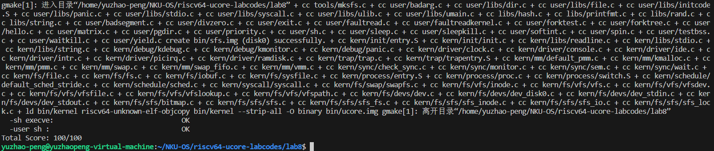
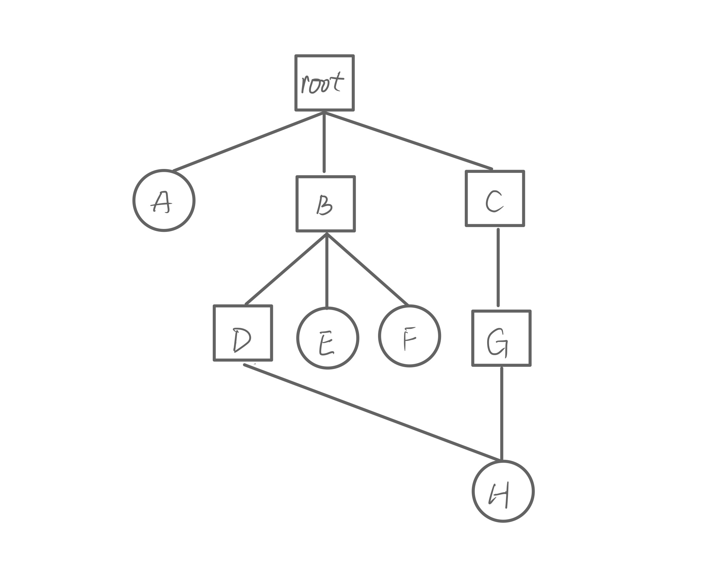

# Lab 8

彭钰钊 2110756	姜涵 2113630	王健行 2111065

### 一、实验要求：

- 基于markdown格式来完成，以文本方式为主
- 填写各个基本练习中要求完成的报告内容
- 列出你认为本实验中重要的知识点，以及与对应的OS原理中的知识点，并简要说明你对二者的含义，关系，差异等方面的理解（也可能出现实验中的知识点没有对应的原理知识点）
- 列出你认为OS原理中很重要，但在实验中没有对应上的知识点

### 二、知识点整理：

#### 1.多个线程有几个fd？几个file？

在多线程的环境中，每个线程都有自己的文件描述符（File Descriptor，简称FD）和文件结构（File Structure）。

1. **文件描述符（FD）：**
   - 在每个线程中，文件描述符是独立的。这意味着一个线程中的文件描述符并不直接影响其他线程的文件描述符。
   - 每个线程可以在其自己的上下文中打开、关闭、读取和写入文件描述符，而不会影响其他线程对其文件描述符的操作。

2. **文件结构（File Structure）：**
   - 每个线程在打开文件时都会创建一个独立的文件结构。这个文件结构包含了关于文件的各种信息，例如文件的当前位置、是否可读和可写等。
   - 不同线程的文件结构是相互独立的，它们记录各自线程对文件的状态和操作。

综上所述，在多线程环境中，每个线程都有自己的文件描述符和文件结构。这样的设计可以确保线程之间的文件操作相互独立，不会互相影响。每个线程可以同时操作多个文件，每个文件都有其独立的文件描述符和文件结构。

#### 2.VFS——虚拟文件系统

Virtual File System (VFS) 的存在主要是为了提供一个抽象层，使得操作系统和用户空间的程序能够通过统一的接口访问不同类型的文件系统，而不必关心底层文件系统的具体实现细节。以下是一些使用 VFS 的主要原因：

1. **透明性和统一性：**
   - VFS 提供了一个统一的、抽象的文件系统接口，使得应用程序、系统调用和其他文件系统相关的组件能够通过相同的函数调用来访问文件。
   - 应用程序不需要关心底层文件系统的类型，从而提高了文件系统的透明性和统一性。

2. **多文件系统支持：**
   - 操作系统可能支持多种文件系统，如FAT、NTFS、ext4等。通过使用 VFS，操作系统能够在运行时选择适当的文件系统来处理文件操作，而不需要修改应用程序代码。
   - VFS 允许系统同时挂载多个文件系统，并在运行时动态切换它们，提供了更大的灵活性。

3. **易于扩展和维护：**
   - 新的文件系统可以相对容易地添加到系统中，而无需修改现有应用程序的代码。只需为新的文件系统实现相应的 VFS 接口即可。
   - VFS 的存在使得文件系统的维护和升级更加容易，因为修改底层文件系统的实现不会影响到上层的应用程序和系统调用。

4. **操作系统独立性：**
   - VFS 提供了一个通用的接口，可以屏蔽掉不同操作系统对文件系统的不同实现方式。这意味着相同的应用程序可以在不同的操作系统上运行，而不必担心文件系统接口的差异。

#### 3.设备文件

在类Unix系统中，一种常见的设计理念是"一切皆文件"（Everything is a file）。这意味着文件系统把许多系统资源、设备和通信渠道都表示为文件或文件类似的结构。在这个理念下，设备也被视为文件，通常称为设备文件。设备文件是文件系统中的一种特殊类型的文件，用于与系统中的硬件设备进行交互。通过在文件系统中使用设备文件，应用程序可以通过标准的文件I/O接口来与设备进行通信，就像它们在读写普通文件一样。

设备文件通常位于 `/dev` 目录下，例如 `/dev/sda` 可能代表系统上的硬盘设备。应用程序可以打开、读取和写入这些设备文件，从而与硬件设备进行交互。


### 三、实验练习：

#### **练习0：填写已有实验**

> 本实验依赖实验2/3/4/5/6/7。请把你做的实验2/3/4/5/6/7的代码填入本实验中代码中有“LAB2”/“LAB3”/“LAB4”/“LAB5”/“LAB6” /“LAB7”的注释相应部分。并确保编译通过。注意：为了能够正确执行lab8的测试应用程序，可能需对已完成的实验2/3/4/5/6/7的代码进行进一步改进。

由于我们是空降Lab8的，因此我们调度算法仍然使用原有的算法：

```c
void
schedule(void) {
    bool intr_flag;
    list_entry_t *le, *last;
    struct proc_struct *next = NULL;
    local_intr_save(intr_flag);
    {
        current->need_resched = 0;
        last = (current == idleproc) ? &proc_list : &(current->list_link); // idleproc是不在进程列表里的
        le = last;
        do {
            if ((le = list_next(le)) != &proc_list) {
                next = le2proc(le, list_link);
                if (next->state == PROC_RUNNABLE) {
                    break;
                }
            }
        } while (le != last);
        if (next == NULL || next->state != PROC_RUNNABLE) {
            next = idleproc;
        }
        next->runs ++;
        if (next != current) {
            proc_run(next);
        }
    }
    local_intr_restore(intr_flag);
}
```

#### **练习1: 完成读文件操作的实现（需要编码）**

> 首先了解打开文件的处理流程，然后参考本实验后续的文件读写操作的过程分析，填写在 kern/fs/sfs/sfs_inode.c中 的sfs_io_nolock()函数，实现读文件中数据的代码。

UNIX的文件系统中，通用文件模型定义了几个很重要的对象：

- **索引节点（inode)**：存储关于某个文件的元数据信息（如访问控制权限、大小、拥有者、创建时间、数据内容等等），通常对应磁盘上的**文件控制块（file control block)**. 每个索引节点有一个编号，唯一确定文件系统里的一个文件。
- **文件(file)**: 不是指磁盘上的一个”文件“， 而是指一个进程和它打开的一个文件之间的关系，这个对象存储在内核态的内存中，仅当某个进程打开某个文件的时候才存在。文件中的内容可理解为是一个buffer，每个文件都有一个方便应用程序识别的文件名称
- **目录项（dentry）：**它主要从文件系统的文件路径的角度描述了文件路径中的特定目录。。简单来说，目录是一种特殊的文件，包含若干个子目录和其他文件；而目录项不是目录，而是文件路径中的一部分。从某个子目录、文件的名称，对应到具体的文件/子目录的地址(或者索引节点inode)的链接，通过目录项(dentry)来描述。比如，某文件路径名是"/test/file1"，则包含的目录项为：根目录'/',目录'test'和文件'file1'。

inode 是从文件系统的单个文件的角度它描述了文件的各种属性和数据所在位置，相当于一个索引。

> （指导书）假如应用程序操作文件（打开/创建/删除/读写），首先需要通过文件系统的通用文件系统访问接口层给用户空间提供的访问接口进入文件系统内部（抽象层），接着由文件系统抽象层把访问请求转发给某一具体文件系统（比如 SFS 文件系统），具体文件系统把应用程序的访问请求转化为对磁盘上的 block 的处理请求，并通过外设接口层（IO接口）交给磁盘驱动例程来完成具体的磁盘操作。  

由于文件是一层一层这样传输调用的，因此不同层次用到的inode存在一定的上下级关系。

sfs_disk_inode相当于磁盘层面上的inode，对应到了一个文件，它是SFS层面上的sfs_inode 的一个成员；而再往上则是VFS层面的抽象inode，它和SFS的inode对接。  

VFS上的inode数据结构是位于内存的索引节点，把不同文件系统的特定索引节点信息（甚至不能算是一个索引节点)统一封装起来，避免了进程直接访问具体文件系统。阅读代码，我们看到在 VFS 层面的 inode，包含了 SFS 和硬件设备 device 的情况。

实验中SFS文件系统使用了一段连续内存来存放很多个4k大小的block，0号位置上是超块，是一个文件系统的全局角度描述特定文件系统的全局信息（magic、总块数 blocks、空闲块数 unused_blocks 等）；1号块是根目录块；2号块起是位图块，记录块是否被占用；随后是正常的块数据部分。

**打开文件的处理流程：**文件的访问流程在上面已有简单说明。在此按照层次进行详细解释。

1. 通用文件访问接口层的处理流程侧：调用用户态函数：`open->sys_open->syscall`，从而引起系统调用，进入到了内核态。随后，通过中断处理，会调用到 `sys_open`这一函数，并进一步调用 `sysfile_open` 。此处，需要将要打开的文件的路径和打开方式传给`sysfile_open`。该函数调用了`file_open` 函数，进行一些打开方式的判定后，会尝试为这个要打开的文件分配一个file变量。该变量是当前进程的打开文件数组`current->fs_struct->filemap[]`中的一个空闲元素，而这个元素的索引值，就是最终要返回给进程的fd1（即文件描述符）。到此为止，虽然返回了fd1，但我们还没有找到文件的inode，因此需要进一步调用 `vfs_open` 函数，进入了下一层。
2. 文件系统抽象层（VFS）。`vfs_open` 调用`vfs_lookup`，根据传入的路径path，获得对应的根inode。根据path的不同，处理方式也有差别。

> （指导书）vfs_lookup 函数是一个针对目录的操作函数，它会调用 vop_lookup 函数来找到 SFS 文件系统中的目录下的文件。为此，vfs_lookup 函数首先调用 get_device 函数，并进一步调用 vfs_get_bootfs 函数（其实调用了）来找到根目录“/”对应的 inode。这个 inode 就是位于 vfs.c 中的 inode 变量 bootfs_node。这个变量在 init_main 函数（位于kern/process/proc.c）执行时获得了赋值。通过调用vop_lookup 函数来查找到根目录“/”下对应文件sfs_filetest1 的索引节点，，如果找到就返回此索引节点。

3. 具体文件系统层（SFS）：

```C++
static const struct inode_ops sfs_node_dirops = {
……
.vop_lookup                     = sfs_lookup,
};
```

inode结点的函数`vop_lookup`就可以使用到`sfs_lookup`，由此进入了sfs。在`sfs_lookup`中循环调用了`sfs_lookup_once`，把path不断分解，最终path无法分解时说明找到了目标inode，此时可以顺利返回。

4. 具体io：在此open打开文件操作不涉及io相关，io相关在后续部分介绍。

**文件读写操作的过程分析：** 经阅读代码，可以发现读写操作与open有很多类似之处。由`syscall`，调用了`sysfile_read`函数，其参数`len`是文件一共需要读写的长度。该函数先进行`file_testfd`检查文件是否正常，随后分配了大小为`IOBUF_SIZE`的buffer（实验中是4096）作为读写缓冲区。也就是说，一次最多读写`IOBUF_SIZE`个字节；若文件很大，那么要分多次进行读写。之后开始循环，文件每次读写的实际长度为`alen`。调用`file_read`函数，该函数先通过fd找到file，在根据要读取的长度`alen`声明对应的iobuffer，使用`vop_read`函数读取。与上面的类似，实际上使用`sfs_read`读取，进入SFS层。`sfs_read`调用了`sfs_io`。`sfs_io`在得到文件信息后、完成加锁等后，调用`sfs_io_nolock`完成读写，该函数就是练习1需要补充的函数。

```C
    // 用offset % SFS_BLKSIZE判断是否对齐，如果未对齐则从偏移量开始读/写一些内容到第一个块的末尾
    if ((blkoff = offset % SFS_BLKSIZE) != 0) {
        size = (nblks != 0) ? (SFS_BLKSIZE - blkoff) : (endpos - offset);
        // nblks == 0 表示文件大小<4096B（一个块大小），当前读/写操作在同一个块内完成
        // 当前读写操作的大小就是从当前偏移位置 offset 到结束位置 endpos 的距离
        // size 被设置为当前块中剩余的空间，即 SFS_BLKSIZE - blkoff
        // 找到磁盘块号
        if ((ret = sfs_bmap_load_nolock(sfs, sin, blkno, &ino)) != 0) {
            goto out;
        }
        // 读写操作
        if ((ret = sfs_buf_op(sfs, buf, size, ino, blkoff)) != 0) {
            goto out;
        }
        // 更新后续读写需要的参数
        alen += size;
        buf += size;
        if (nblks == 0) {
            goto out;
        }
        blkno++;
        nblks--;
    }
    // 读/写对齐的块
    while (nblks > 0) {
        if ((ret = sfs_bmap_load_nolock(sfs, sin, blkno, &ino)) != 0) {
            goto out;
        }
        if ((ret = sfs_block_op(sfs, buf, ino, nblks)) != 0) {
            goto out;
        }

        alen += nblks * SFS_BLKSIZE;
        buf += nblks * SFS_BLKSIZE;
        blkno += nblks;
        nblks -= nblks;
    }
    // 如果结束位置与最后一个块不对齐，则从开头读/写一些内容到最后一个块的(endpos % SFS_BLKSIZE)位置
    if ((size = endpos % SFS_BLKSIZE) != 0) {
        if ((ret = sfs_bmap_load_nolock(sfs, sin, blkno, &ino)) != 0) {
            goto out;
        }
        if ((ret = sfs_buf_op(sfs, buf, size, ino, 0)) != 0) {
            goto out;
        }
        alen += size;
    }
```

可以看到，参数`offset`是本次读取的初始地址偏移量，`alenp`是本次读取的长度，`offset+alenp`就是本次读取的终点位置。在知道以上信息后，可以计算出读取的内容位于哪些块中。而在读取时，首先要对第一个块是否对齐进行判断。如果offset 不能整除 SFS_BLKSIZE，则得到的余数，就是本次读取需要从块的这个位置读取。

结束位置的块也类似，计算出`endpos % SFS_BLKSIZE`,这个值就是最后位置的那个块要读取的字节数。

而具体完成读取则是先通过`sfs_bmap_load_nolock`得到磁盘块号，再用`sfs_buf_op`完成读取工作。在寻找磁盘块号时，`sfs_bmap_load_nolock`对直接索引和间接索引页进行了讨论，间接索引通过递归调用寻找目标块号。

#### **练习2: 完成基于文件系统的执行程序机制的实现（需要编码）**

> 改写proc.c中的load_icode函数和其他相关函数，实现基于文件系统的执行程序机制。执行：make qemu。如果能看看到sh用户程序的执行界面，则基本成功了。如果在sh用户界面上可以执行”ls”,”hello”等其他放置在sfs文件系统中的其他执行程序，则可以认为本实验基本成功。

本次实验基于Lab5的代码进行修改，主要区别为读ELF文件的部分，除了load_icode函数中的相关修改外，在alloc_proc函数中也需要添加一行代码`proc->filesp = NULL;`该代码表示文件系统进程控制结构的初始化。

然后就是我们本部分的主体——load_icode函数：

首先，我们将修改Lab5中从内存读取用户ELF文件头以及程序文件头的方式：

```c
// 其他代码...
// (3) 从文件中加载程序到内存（注意：与Lab5的区别）
    struct elfhdr __elf, *elf = &__elf;
    // (3.1) 从磁盘中读取ELF可执行文件的首部
    if ((ret = load_icode_read(fd, elf, sizeof(struct elfhdr), 0)) != 0) {
        goto bad_elf_cleanup_pgdir;
    }
    // 判断ELF首部是否合法——魔数
    if (elf->e_magic != ELF_MAGIC) {
        ret = -E_INVAL_ELF;
        goto bad_elf_cleanup_pgdir;
    }
    // (3.2) 根据ELF文件首部信息获取段首部
    struct proghdr __ph, *ph = &__ph;
    uint32_t vm_flags, perm, phnum;
    // e_phnum表示程序段数目
    for (phnum = 0; phnum < elf->e_phnum; phnum ++) {
        // 循环获取段首部
        off_t phoff = elf->e_phoff + sizeof(struct proghdr) * phnum;
        if ((ret = load_icode_read(fd, ph, sizeof(struct proghdr), phoff)) != 0) {
            goto bad_cleanup_mmap;
        }
// 其他代码...
```

本部分使用函数`load_icode_read`来完成对用户ELF文件头以及程序文件头的读取，该函数实际上就是调用了文件系统的接口。

此外我们实现了终端的参数输入，因此我们需要重新编写代码实现参数的初始化：

```c
// 其他代码...
// (6) 在用户堆栈中设置 uargc 和 uargv
    //setup argc, argv
    uint32_t argv_size=0, i;
    for (i = 0; i < argc; i ++) {  // 计算参数总长度
        argv_size += strnlen(kargv[i],EXEC_MAX_ARG_LEN + 1)+1;
    }

    uintptr_t stacktop = USTACKTOP - (argv_size/sizeof(long)+1)*sizeof(long);
    char** uargv=(char **)(stacktop  - argc * sizeof(char *));

    argv_size = 0;
    for (i = 0; i < argc; i ++) {  // 存储参数
        uargv[i] = strcpy((char *)(stacktop + argv_size ), kargv[i]);  // uargv[i]保存了kargv[i]在栈中的起始位置
        argv_size +=  strnlen(kargv[i],EXEC_MAX_ARG_LEN + 1)+1;
    }

    // 栈的地址增长方式为从高向低增长，因此第一个参数的地址为栈顶，压入一个int类型变量用于存储参数数量
    stacktop = (uintptr_t)uargv - sizeof(int);
    *(int *)stacktop = argc;
// 其他代码...
```

**实验结果：**



#### **扩展练习 Challenge1：完成基于“UNIX的PIPE机制”的设计方案**

> 如果要在ucore里加入UNIX的管道（Pipe)机制，至少需要定义哪些数据结构和接口？（接口给出语义即可，不必具体实现。数据结构的设计应当给出一个(或多个）具体的C语言struct定义。在网络上查找相关的Linux资料和实现，请在实验报告中给出设计实现”UNIX的PIPE机制“的概要设计方案，你的设计应当体现出对可能出现的同步互斥问题的处理。）

**（1）UNIX的管道（Pipe)机制：**

可以将一个进程的输出与另一个进程的输入相连接，形成一个数据流的传输通道的进程间通信机制。

在Unix或类Unix系统中，管道通常是通过操作系统内核中的一个缓冲区实现的，其输入和输出被映射到两个文件描述符上。一个进程通过向管道写入数据（将数据写入管道的输入端），另一个进程通过从管道读取数据（从管道的输出端读取数据），从而实现数据的传输。

**（2）要定义的数据结构和接口：**

- **数据结构**：管道结构体

为了实现管道机制，需要在内核中定义一个管道数据结构来存储进程间传输的数据。该数据结构包括：

- 用于管道的同步互斥的信号量，保护管道的读取和写入操作，防止多个进程同时访问导致数据不一致。
- 管道的缓冲区，存储从一个进程向管道写入的数据，以便其他进程从管道读取。
- 管道缓冲区的大小，指定管道能够容纳的数据量的上限。
- 读取位置，指示下一个要读取的数据的位置的索引。
- 写入位置，指示下一个要写入数据的位置的索引。

```C
struct pipe {
    struct semaphore sem;  // 用于管道的同步互斥
    struct page* buffer;   // 管道缓冲区的页框
    size_t size;           // 缓冲区大小
    size_t read_pos;       // 读取位置
    size_t write_pos;      // 写入位置
};
```

- **接口**
  - 创建管道接口：
    - 用于创建一个新的管道
    - 当进程A需要向进程B发送数据时，它可以调用pipe()系统调用，该调用将创建一个新的管道，并返回一个文件描述符（fd）。进程A将使用该fd来写入数据到输出缓冲区中。进程B将使用相同的fd从输入缓冲区中读取数据。
  - 读取管道接口：
    - 从管道中读取数据到缓冲区。
    - 如果输入缓冲区为空，则调用read()会被阻塞，直到数据可用为止。
  - 写入管道接口：
    - 将数据从缓冲区写入管道。
    - 如果输出缓冲区已满，则调用write()会被阻塞，直到有足够的空间可用为止。
  - 关闭管道接口
    - 关闭管道并释放相关资源。
    - 当不再需要管道时，进程可以使用close()系统调用来关闭读或写端口。当所有相关的fd都被关闭时，管道将被销毁。

**（3）同步互斥问题的处理**

由于管道是共享的，当一个进程向管道中写入数据时，应该确保在另一个进程读取数据之前，该数据不会被覆盖或修改。在管道结构中使用**信号量**（semaphore）来保证对管道的读写操作是互斥的。

**（4）概要设计方案：**

- 进程创建与通信：
  - 使用系统调用（例如fork()）创建两个子进程，分别代表两个要连接的命令。
  - 使用进程间通信（Inter-Process Communication，IPC）机制，如管道（pipe）进行数据传递。
- 命令解析与执行：
  - 解析用户输入的命令，分割成多个命令及其参数。
  - 对每个命令创建一个子进程，并执行相应的程序。
- 管道连接：
  - 在父进程中创建一个管道，将其连接到两个子进程之间，使得一个子进程的输出成为另一个子进程的输入。
- 重定向文件描述符：
  - 在子进程中通过系统调用将标准输出或标准输入重定向到管道的写端或读端，实现输出传递。
- 等待子进程完成：
  - 父进程等待两个子进程完成执行，确保命令按顺序执行。
- 通过虚拟文件系统实现
  - 为了兼容UNIX的标准I/O接口，可以在虚拟文件系统（VFS）中实现管道机制。这样，管道就可以像其他文件一样使用标准的I/O函数进行读写操作。
  - 在VFS中，每个管道都可以被表示为一个特殊的文件类型，比如“FIFO”文件。当进程打开FIFO文件时，将创建一个新的fd，并将该fd与管道相关联。然后，进程就可以使用标准的I/O函数进行读写操作了。

#### **扩展练习 Challenge2：完成基于“UNIX的软连接和硬连接机制”的设计方案**

> 如果要在ucore里加入UNIX的软连接和硬连接机制，至少需要定义哪些数据结构和接口？（接口给出语义即可，不必具体实现。数据结构的设计应当给出一个(或多个）具体的C语言struct定义。在网络上查找相关的Linux资料和实现，请在实验报告中给出设计实现”UNIX的软连接和硬连接机制“的概要设计方案，你的设计应当体现出对可能出现的同步互斥问题的处理。）

首先我们简单说明一下什么是“软连接”和“硬连接”。**软连接**也称为符号连接，类似于Windows系统下的快捷方式。软连接文件是一个特殊的文本文件，其内容为连接的原始文件的位置信息。**硬连接**是指通过索引节点来进行连接的方式，即一个文件拥有多个有效路径名。



如图所示，文件项D和G指向同一个文件H，即为硬连接。如果文件E中存储的是字符串`root/C/G/H`，那么它是一个软连接。

因此根据上述概念可以进行如下设计：

**数据结构**

- `file`：表示文件的数据结构

```c
struct file {
    enum {
        FD_NONE, FD_INIT, FD_OPENED, FD_CLOSED,
    } status;                         // 访问文件的执行状态
    bool readable;                    // 文件是否可读
    bool writable;                    // 文件是否可写
    int fd;                           // 文件在filemap中的索引值
    off_t pos;                        // 访问文件的当前位置
    struct inode *node;               // 该文件对应的内存inode指针
    int open_count;                   // 打开此文件的次数
    //==========引入新的字段==========
    bool is_symbolic_link;			  // 如果文件是软链接，则为 true
};
```

- `inode`：表示索引节点的数据结构

```c
/* inode (on disk) */
// 记录文件或目录的内容存储的索引信息，该数据结构在硬盘中存储（一段连续的字节），需要时读入内存
// ！注意：0 表示一个无效的索引，block 0 用来保存 super block，它不可能被其他任何文件或目录使用
struct sfs_disk_inode {
    uint32_t size;                                  /* size of the file (in bytes) */
    // 如果inode表示常规文件，则size是文件大小
    uint16_t type;                                  /* one of SYS_TYPE_* above */
    // inode的文件类型
    uint16_t nlinks;                                /* # of hard links to this file */
    // 此inode的硬链接数
    uint32_t blocks;                                /* # of blocks */
    // 此inode的占据数据块数的个数
    uint32_t direct[SFS_NDIRECT];                   /* direct blocks */
    // 此inode的直接数据块索引值（有SFS_NDIRECT个）
    uint32_t indirect;                              /* indirect blocks */
    // 此inode的一级间接数据块索引值
//    uint32_t db_indirect;                           /* double indirect blocks */
//   unused
    //==========引入新的字段==========
    uint32_t link_type;    // 链接类型：0 表示常规文件，1 表示硬链接，2 表示软链接
};
```

- `entry`：表示目录项的数据结构

```c
/* file entry (on disk) */
// 表示一个目录中的子项（目录/文件），每个占用一个block
struct sfs_disk_entry {
    uint32_t ino;                                   /* inode number */
    // 索引节点所占数据块索引值——inode的位置，磁盘编号（偷懒做法）
    char name[SFS_MAX_FNAME_LEN + 1];               /* file name */
    // 文件名
    //==========引入新的字段==========
    uint32_t link_type;    // 链接类型：0 表示常规文件，1 表示硬链接，2 表示软链接
};
```

基于上述数据结构，我们可以设计软链接和硬链接的接口，包括创建、删除连接，以及读取软连接目标路径。

1. **创建硬链接接口：**

```c
int sfs_create_hard_link(const char *src_path, const char *link_path);
```

**参数含义：**

- `src_path`：源文件路径，即要创建硬链接的文件。
- `link_path`：链接文件路径，即要创建的硬链接。

**返回值：**

- 成功：返回 0。
- 失败：返回错误码。

**具体实现：**

- 检查源文件是否存在。
- 在目标路径创建一个新的目录项，将其`ino`字段设置为源文件的`ino`，并将`link_type`字段设置为1（硬链接）。
- 增加源文件的硬链接计数。

2. **创建软链接接口：**

```c
int sfs_create_soft_link(const char *target_path, const char *link_path);
```

**参数含义：**

- `target_path`：软链接的目标路径，即链接所指向的文件或目录。
- `link_path`：链接文件路径，即要创建的软链接。

**具体实现：**

- 检查源文件是否存在。
- 在目标路径创建一个新的目录项，将其`ino`字段设置为源文件的`ino`，并将`link_type`字段设置为2（软链接）。
- 将源文件的路径写入目标路径对应的数据块中。

**返回值：**
- 成功：返回 0。
- 失败：返回错误码。

3. **删除链接接口：**

```c
int sfs_remove_link(const char *link_path);
```

**参数含义：**

- `link_path`：要删除的链接文件路径。

**具体实现：**

- 找到链接对应的目录项。
- 根据`link_type`字段判断是硬链接还是软链接。
- 对于硬链接，减少硬链接计数；对于软链接，删除目标路径对应的数据块。
- 从目录中删除链接的目录项。

**返回值：**
- 成功：返回 0。
- 失败：返回错误码。

4. **读取软链接目标路径接口：**

```c
int sfs_read_soft_link(const char *link_path, char *target_buffer, size_t buffer_size);
```

**参数含义：**

- `link_path`：软链接文件路径。
- `target_buffer`：用于存储目标路径的缓冲区。
- `buffer_size`：目标缓冲区的大小。

**具体实现：**

- 找到软链接对应的目录项。
- 读取目标路径对应的数据块内容，存储到`target_path`缓冲区中。

**返回值：**

- 成功：返回读取的字符数。
- 失败：返回错误码。

5. **同步互斥问题处理：**
   - 在链接的创建和删除接口中，使用信号量或其他同步机制，确保在多线程或多进程环境中链接的创建和删除是原子操作，避免冲突。
   - 使用文件系统的 inode 上的信号量或其他同步机制，以确保对文件系统结构的修改是原子的。

### Github链接

https://github.com/Yuzhao-P/NKU-2023OS-GroupWork